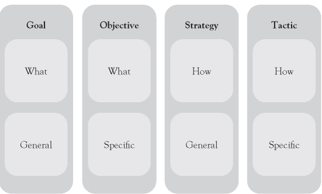
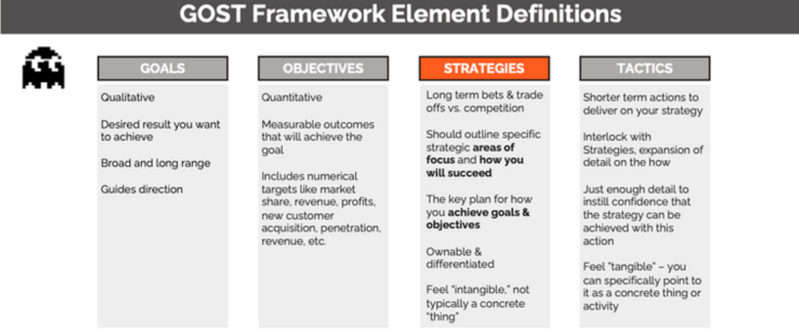

Open Threat Hunting Framework Foundational

# Introduction

Establishing or maturing an effective threat hunting program is a challenging
task compared to approaching threat hunting from an unofficial perspective where
existing security resources execute ad-hoc hunts in their spare time however, a
well-designed and dedicated threat hunting program can be a major driver in
changing the security culture of an entire organization.

The purpose of this document is to provide foundational understanding of Threat
Hunting and introduce the Open Threat Hunt Framework (OTHF) which are practical
guidelines to developing and maturing an effective threat hunting program.

The goal of the OTHF is to provide organizations with a framework which provides
guidance on implementing core organizational, operational, and technical
components to launch and mature threat hunting operation. The OTHF is completely
vendor and tool agnostic and not meant to be an exhaustive resource on threat
hunting techniques or analysis but instead designed to present organizations
with often overlooked pieces of threat hunting that have a massive impact on the
success of the program.

While the overall OTHF is designed for organizations attempting to launch and
mature a dedicated threat hunting program staffed with dedicated resources, the
OTHF is modular by design to accommodate organizations who are unable to staff a
dedicated team but can still leverage the operational components to begin or
improve threat hunting within their organization.

# Foundational

## Organizational Support

“Going it alone, you won’t last a day out there” – Sandor Clegane, Game of
Thrones

To launch and mature an effective threat hunting program, it is critical to have
buy-in for executive leadership and sometimes that can be a difficult
conversation to heave with leadership. A major security benefit form threat
hunting is that is offers the ability to verify assumptions about the design,
controls, and behaviors of a network but it also operates within a space that
assumes that existing security protections have failed. Security investments
continue to increase year over year so when approaching leadership to support
investing in a threat hunting team, consider the following guidelines.

Gaining the support of the chief security officer (CSO) or chief information
security officer (CISO) is critically important, and efforts should be made to
gain executive support beyond the security organizational boundaries. The more
executive support a threat hunting program can get the better. If a threat
hunting program does not gain executive support, the effectiveness and growth of
the program will be limited.

Depending on the organization, obtaining long term support from executives can
be challenging but demonstrating the value of threat hunting by showing how
threat hunting can help reduce risk, reduce dwell time, and enhance existing
security teams within the organization can help leadership understand the value
add and buy into the effort.

The following are some data points which can be used to gaining leadership
support:

-   If you’re organization has experienced any breaches, present dwell time,
    impact, and cost data associated with the breaches

-   Present third-party evidence related to the cost of data breaches

-   Present dwell time data from third-party resources

-   Compare recent penetration testing or red team exercise activities against
    existing security tooling highlighting the gaps in detections

-   Consider scheduling a compromise assessment and using the results as data
    point to highlight identified risks, threats, or lack of visibility

The following are some talking points to discuss with leadership regarding the
value-add of threat hunting:

-   Reduce the average time to detect threats

-   Increase the quality of automated detections to reduce alert fatigue and
    improve security operations

-   Ensure security controls are adequate

-   Reduce costly incident response activities

-   Protect intellectual property and brand reputation

Be prepared to submit an official proposal to start a threat hunting program
including an executive summary, justification, cost schedule and deliverables.
The following sections within this framework will be valuable resources in
developing the proposal:

-   Resources and Staffing

-   Data and Technology Audit

-   Metrics

It is quite ok to start small, demonstrate value, and then expand threat hunting
operations as the team provides value to the organization. Details regarding
short- and long-term goals and milestones should be included within the
proposal.

### Example Threat Hunting Program Proposal

TBD

## Organizational Placement

While not a critical component to begin or run an effective threat hunting
program at an organization, the placement of the threat hunting team within an
organization can directly impact how well the value threat hunting is bringing
to the organization is communicated to leadership.

The placement of the threat hunting team may depend on the staffing model of the
threat hunting program. If threat hunting is going to be executed as a part time
function within an existing team obviously, changing the organizational layout
will be challenge however to maximize the effectiveness and growth opportunities
for a threat hunting program, it is best if the threat hunting team directly
informs security leadership such as the CISO or CSO. Directly communication
lines between threat hunters provides leadership direct, unfiltered input into
the state of security within the organization.

## Threat Hunting Definition

“Ask 10 security professionals for the definition of threat hunting and you’ll
get 11 answers”

Each organization that wants to launch or has a threat hunting program must
define what threat hunting means to the organization and that definition should
be driven by the mission statement of the threat hunting program. The OTHF is
not designed to act as the authority of what is or isn’t threat hunting because
threat hunting means a lot of different things to a lot of different people and
that’s ok. The only requirements regarding the definition of threat hunting that
the OTHF includes is:

1.  The organization should decide on and document the definition of threat
    hunting

2.  The definition of threat hunting should be driven by the mission statement
    of the threating hunting program

Considerations organizations should include when defining threat hunting:

-   Avoid hunting for activities that are already being detected by
    differentiating between proactive from reactive efforts

    -   If you define threat hunting as an activity that involves purposefully
        seeking out evidence of malicious activities within the environment that
        did not generate security alerts, the organization can avoid
        duplications of effort and maximize value add to the organization.
        Additionally, if an organization specifically calls out how threat
        hunting is a proactive approach to cybersecurity, it can eliminate
        confusion as to how threat hunting differs from incident response or
        security operations responding to an alert.

-   Describe threat hunting as a dedicated, repeatable process

    -   Threat hunting benefits from a methodical approach. From the threat
        hunters perspective, hunters will benefit from a disciplined approach to
        understand the threats applicable to the target environment, understand
        their respective techniques, tactics, and procedures, and then use that
        information to determine what clues to look for that might indicate an
        attack underway. Additionally, a well-defined process makes it easier to
        track improvements, increase collaboration, and provide quality control.

-   The value of including language to ensure threat hunting is based upon a
    hypothesis

    -   The main advantage of leveraging a hypothesis-based threat hunting model
        is that it ensures that a threat hunt is testable and provides
        guidelines to determine success or failure. Additionally, a hypothesis
        provides a clear statement of the question that the hunter intends to
        investigate. Without a hypothesis, a threat hunting can become unfocused
        and difficult to conclude any sort of concrete findings. There are
        activities within threat hunting that may not have a formal hypothesis
        such as generation observations on the behavioral data of systems or
        users within the network such as “I wonder how many users actually use
        PowerShell on a day-to-day basis?” however such observational research
        should be used to create a hypothesis-based threat hunt.

Example definitions of threat hunting:

-   Threat Hunting is a dedicated, continuous, hypothesis-based search
    methodology to reduce the time to detect adversaries operating within an
    environment that have yet to be detected.

-   “Threat hunting is the practice of proactively searching for cyber threats
    that are lurking undetected in a network”.[^1]

-   “Cyber threat hunting is a proactive security search through networks,
    endpoints, and datasets to hunt malicious, suspicious, or risky activities
    that have evaded detection by existing tools.”[^2]

-   “Threat hunting is the practice of searching for cyber threats that might
    otherwise remain undetected in your network.”[^3]

-   “"a focused and iterative approach to searching out, identifying, and
    understanding adversaries internal to the defender's networks.”[^4]

[^1]: https://www.crowdstrike.com/cybersecurity-101/threat-hunting/

[^2]: https://www.trellix.com/en-us/security-awareness/operations/what-is-cyber-threat-hunting.html

[^3]: https://www.checkpoint.com/cyber-hub/cloud-security/what-is-threat-hunting/

[^4]: https://www.sans.org/white-papers/who-what-where-when-why-how-effective-threat-hunting/

## Mission Statement

It is essential that organizations set the clear expectations, principles, and a
vision for the Threat Hunting Team. A mission statement is a critical component
to help communicate the purpose and direct the threat hunting program in the
right direction. The growth and success of the threat hunting program will be
dependent on short-, medium-, and long-term goals and the mission statement
provides an invaluable navigation tool to define and obtain goals. It is
important to note that a mission statement is not meant to be something used
during just the launch of the threat program but a navigational beacon that
provides direction as the program grows and matures. Additionally, a
well-constructed mission statement will help the team see the meaning and
purpose of their work by giving them clear reasons their job benefits a larger
goal. The best part about mission statements is that they can always been
changed. Do not be afraid to replace or revise your mission statement as your
threat hunting program grows and matures.

Consider the following example mission statement:

*To be the driving force in custom automated adversary detection targeting XYZ
.*

From this mission statement, the reader immediately understands that this threat
hunting program is focused on hunting for adversary activities and creating
automated detections specific to the organization so it’s reasonable to assume
that a big focus of this threat hunting program would be identifying and
understanding relevant adversaries and developing threat hunts that would
transition well to custom automated detections.

Here are some recommendations for building a mission statement for threat
hunting:

-   Keep it concise and do not exceed more than one or two sentences and

-   Consider including language to ensure that threat hunting is meant to
    compliment existing security teams, not replace them

-   Get feedback and include the team members in its development

-   It’s not important to include details into how goals will be achieved

-   Attempt to include components that align with the mission statement and core
    values of the overall organization

# Structure

# Preparation

“Data” is everything. Without data, there is nothing to investigate, nothing to
hunt for. Reliability of the data determines how productive and efficient will
be your hunt team. It won’t be wrong to say Data Science is a key element of
Threat Hunting. Therefore, it is important to discuss data, data reliability and
data dictionary.

## The Data

Threat hunting involves analyzing data from variety of sources to recognize
unusual patterns. There is no standard on how much data will be needed or what
data sources will be needed for specific threat hunt.

These logs would come from network activity and the data from operating systems
of endpoints and applications. First, it is important to understand, based on
the operational environment, what fundamental data sources are available at your
disposal. The data sources can be categorized as network, end points or security
relevant. The security event data would come from:

1.  Physically controlled areas: Data centers, Server Racks / Cabinets, or
    Control Centers have gates for access control, CCTV cameras, or heat
    sensors.

2.  Networking devices: this would include network access control devices such
    as web proxies, firewalls and intrusion prevention systems, detective
    controls such as intrusion prevention systems.

3.  Network traffic: packet capture

4.  Operating system on End Points: Different end points such as servers,
    workstations, or Human Machine Interaces (HMIs) provide system events
    (operations performed by OS) and audit events.

5.  Applications and Services: Customized or Commercial Off The Shelf (COTS)
    applications, services, Application Programming Interfaces (APIs) will
    provide data request and responses, usage information and other significant
    events.

6.  Security software: Data from Antimalware software, and vulnerabilities
    management software

The information should be documented in detail with standardized metadata in a
central repository. This metadata repository is also called as event data
dictionary. It is important because different fields / attributes available in
the event data could provide contextual information for data analysis and
correlation.

## 1.2 Developing and Maintaining Data Dictionary

Threat hunting requires a thorough understanding of normal operations. That
means, it is essential to know every single data source logged and collected for
development of analytics

e.g. Security, Sysmon or PowerShell logs. Beyond log sources, team should also
know the attributes behind every log data collected. Why?, data scientists or
analysts spend 80% of their time just finding, cleaning and organizing data.
Threat hunting effort is no different. The threat hunter must have an easy way
to discover, access and share the data.

“Data Dictionary” solves this problem. The Data Dictionary is a collection of
names, definitions, and attributes about data elements that are being used or
captured. Data dictionary helps avoides data inconsistencies, provides
consistency in the collection and use of data, and enforces the use of data
standardization. A data dictionary should become the go-to tool to understand
everything about a data set and check data quality at a glance.

If you have recently initiated or kicked-off the Threat Hunting program or have
no data governance team, it is likely that Data Dictionary doesn’t exist within
your organization. Creating Data Dictionary is not a small endeavor. Effort
required to develop the data dictionary largely depends on the technology
landscape of the organization, organizational processes and available human
resources. Organizations may choose to develop it all at once (focused project)
or gradually develop and improve this library during different security
initiatives.

Specific contents in a data dictionary can vary. In general, these components
are various types of metadata, providing information about data. When planning
to create a data dictionary, it is important to consider all available data
management resources, including databases and spreadsheets. Online templates are
useful for creating this type of data dictionary . Dragos introduced “Collection
Management Framework”[^5] that provides guidance on keeping track of tools used
and data being collected.

[^5]: [Collection Management Frameworks – Looking Beyond Asset Inventories in
    Preparation for and Response to Cyber
    Threats](https://www.dragos.com/wp-content/uploads/CMF_For_ICS.pdf?hsCtaTracking=1b2b0c29-2196-4ebd-a68c-5099dea41ff627c19e1c-0374-490d-92f9-b9dcf071f9b5)

Initiate the development by assessing and documenting the tools implemented and
configured in your organization. Start by listing the data sources at high-level
and then collect more detailed information from each data source Following
resources could be useful for development.

-   Existing commercial security tools within your ecosystem (i.e EDR solutions)
    that collect data for you, your vendor should be providing data dictionaries
    for every security event.

-   Open-Source Security Events Metadata (OSSEM)[^6]. OSSEM defines and share a
    common data model to improve the data standardization and transformation of
    security event logs. It also allows you to define and share data structures
    and relationships identified in security events logs.

-   MITRE CAR[^7] provides the dictionary of data objects that may be monitored
    based on MITRE ATT&CK framework

[^6]: <https://github.com/OTRF/OSSEM>

[^7]: <https://car.mitre.org/>

## Data Reliability

Let us focus on the use of data now. Threat hunter will use scientific methods,
processes, algorithms and systems to extract knowledge and insights from noisy,
structured and unstructured data, and apply knowledge from data across a broad
range of application domains. Therefore, data reliability crucial. It is an
aspect of data quality that defines how much data is complete and accurate. This
improves the data trust. It eliminates the guesswork, gives accurate analysis
and insights.

Reliable data is:

-   Complete – datasets must contain all required information. It should not be
    limited to high value assets.

-   Accurate – data must conform with reality.

-   Timely – data must be accurate in a specific period.

-   Validated – data must have right values for the attributes.

-   Consistent – data may get stored and transported to different applications,
    quality of data must be maintained.

-   Unique – the data set shouldn’t be recorded more than once.

Low reliability of the data can result in aggregations of incorrect data that
can lead to wrong decisions that is, incomplete or incorrect hunt results.

Therefore, investing in data reliability consistently will yield faster and
reliable threat hunts. It will allow the automation of detection, essential for
effective security monitoring.

Mature security organizations likely have security data governance team to
improve the reliability of the data required for security monitoring. However,
that does not guarantee the data reliability. It is feasible that team runs into
the issues such as coverage, missing data, missing standard naming conventions,
parsing issues, and timestamp.

Therefore, it is essential that Data Governance and Threat Hunt teams work side
by side, share the hunt objectives and findings. This feedback process will
ensure the continuous improvement needed for improving data reliability.

In the absence of data governance team, Threat Hunt team should assess and
improve data reliability.

## Technology Stack

The event data generated by different data sources within the organization is
continuous. The Size of an organization greatly influences the volume of data it
generates. On any given day, a large organization can generate hundreds of
gigabytes of log data. When dealing with that much data, there are some common
issues. The automated data collection, storage and analytic tools is ideal while
analyzing the large volume of data and correlating multiple data sources.

Log management systems allow log data collection, data retention, log indexing,
reporting, and searching capabilities. Whereas, Security Incident and Event
Management (SIEM) system is characterized by Security Event Management (SEM),
Eecurity Information Management (SIM), and Security Event Correlation (SEC).
SIEM automatically correlates, including all your log data, better than what
humans can do alone. SIEM approaches log analysis with a security focus.

Organizations have finite resources. Therefore, organizations prioritize the log
sources and data management. Threat hunter must be aware of what data has been
automated and is made available at a centralized location (log management
system) and what data must be collected and extracted manually.

Threat hunters use a variety of tools to support their methodologies. Tools can
include the following:

-   Log management system: this allows threat hunter to query, analyze and
    correlate large volume of data. Allows data analysis and correlation at
    scale.

-   Advanced analytics and statistical analytics tools: If organization has not
    implemented log management or SIEM, open-source tools such as MongoDB or
    Redis tools could support ingestion and analysis of large volume of data.
    Although, feasible, this manual process would require the team to collect
    and load the data manually. This could be very time consuming as, the team
    must:

    -   develop custom parsers for different log sources for data ingestion

    -   develop custom queries for search and correlation of data

-   Spreadsheets: This is well known and universally adopted tool for data
    analysis and statistical analysis. However, it is not optimal while handling
    large volume of data and correlation.

# Operational

Threat Hunting requires a methodical approach. However, it is important to
remember that -Threat Hunting is not a project (time bound activity). As
attackers keep evolving, threat hunters should create new detection mechanisms
and continuously refine existing ones to improve detections (i.e. reduce false
positives and automate). With the OTHF, threat hunt teams can have a continuous
improvement driven framework for threat hunting that is designed to scale to
support even the largest organizations by acting as the driving force behind
automated detections. This isn't the art of fiction. Over the years, the OTHF
team has worked rigorously to create a platform agnostic threat hunting process
and this framework and processes is the result of zeal for effective and
efficient threat hunting that will integrate with automated detection processes
such as Palantir' Automated Detection Strategy (ADS)[^8] and applying lessons
learned during incidents responded.

[^8]: https://github.com/palantir/alerting-detection-strategy-framework

Figure 1: IBM Threat Hunting Framework

At its core, the framework lays out simple steps:

1.  Know the threats as applicable to your company and industry

2.  Understand TTPs for applicable threats

3.  Develop the Threat Hunt per unique TTP

4.  Automate developed Hunts

5.  Periodically revalidate the work – Threats, TTPs and Hunts.

Details below explain how Threat Hunter could benefit from those building blocks
and elaborates the process of Threat Hunting.

## Identifying Hunts

Every organization faces security risks, but the risks aren’t the same for
everyone. An attacker specifically targeting a hospitality organization, for
example, will likely go after different assets than an attacker specifically
targeting an electricity utilities company. Within the organization, targets may
vary. An attack on the accounting department might target financial data or
employees’ personal information, while an attack on the engineering department
might target intellectual property. Additionally, there are also threats that
are opportunistic in nature that are not targeting a specific industry or
organization but can pose as a significant risk.

This section of the OTHF is designed to help organizations identify and
prioritize hunts to maximize the value of the threat hunting program.

### Intelligence Driven

Much like with threat hunting, the OTHF is not meant to be a definite guide on
cyber threat intelligence (CTI), but it is important for a threat hunting
program to understand that CTI can be a major asset to identify and prioritize
threat hunts.

CTI provides crucial support by providing detailed information on
characteristics of previous attacks, common access vectors, and the techniques
and procedures that adversaries employ. Threats are characterized by types of
attackers, common points where an infection might occur, and the procedures
attackers are likely to employ. Understanding the steps attacker may take,
allows the threat hunter to define the potential clues of malicious behavior
aligned with the attack stages.

While having a dedicated CTI team to help identify and prioritize activities for
the threat hunting program is ideal, the OTHF will cover approaches that can be
adapted by organizations of varying levels of maturity.

The OTHF focuses mostly on two types of threat intelligence:

-   Strategic Threat Intelligence (STI) – High level analysis of adversary
    motivations, abilities, and associated targets. STI is not focused on the
    technical details of how an attack will happen but rather this intelligence
    will shed light on why adversaries attack and who they may target.

Tactical Threat Intelligence (TTI) – Detailed analysis of the TTPs associated
with an adversary or malware family. TTI analysis may include multiple reports
for adversary groups or malware families which describe the how an attack will
happen through each of its various stages.

### Strategic Threat Intelligence Sources

In more mature organizations, an internal or third-party CTI team should be
leveraged for the latest intelligence on which adversaries are actively
targeting or most likely to target an organization and would be the underlying
motivation for the attack.

If the threat hunting team has access to a dedicated CTI team, the threat hunt
program should coordinate with the CTI team to receive regular updates on
adversary activities and motivations. The threat hunting program should be able
to identify the top threats to the organization at any given time through a
relationship with the CTI team.

If an organization does not have a dedicated CTI team, threat hunting programs
can leverage several free sources to gather STI data including a mapping
adversary groups to targeted industries and motivations.

### Electronic Transactions Development Agency

# 

## Strategy

The strategy of a threat hunting program is a thoughtfully constructed plan or
approach that outlines how the program will achieve the mission. It’s worth
nothing that strategies play a role in how goals and objectives are accomplished
as well but for the purposes of this section, we will focus on strategy as it
relates to the program’s mission.

A well-crafted strategy provides a clear roadmap sets the tone of the actions
people in the organization should take and identify the priorities to achieve
the desired goals. It is important to note that a strategy is not a mission
statement. When applied properly a strategy will dictate how resources will be
allocated to accomplish the mission. Therefore, threat hunting organizations
should develop a mission statement first before developing a strategy for the
threat hunting program.

It is worth noting that an organization’s strategy is dynamic as it will
continue to change as it adapts to new goals and objectives. Strategies are
critical to the success of a threat hunting program because they are the driving
force behind creating the plans and actions to accomplish goals.

## Goals and Objectives

Every threat hunt program, in fact every hunter, must have a goal in order to
succeed. A goal is the desired result that a program or hunter plans to
accomplish. Goals should be specific, realistic, and attainable and usually have
a deadline. Goals can either be short term or long term and can be any of these
types:

**Long-term goals:**

Big picture goals that often stretch over a significant amount of time and
require accomplishing short term goals to complete.

Example: Make the threat hunting program a leader within the security
organization

**Short-term goals:**

How long-term goals are broken down into manageable pieces. Short-term goals
tend to be easily measured and associated with a specific time period.

Example: Increase awareness of the value threat hunting will bring to the
organization

**Performance-based goals:**

Performance-based goals are associated with specific tasks or objectives that
are easy to measure or evaluate. Performance-based goals are often associated
with a specific time period.

Example: Migrate 100 threat hunts to automated detections by the end of Q1.

**Quantitative goals:**

Quantitative goals are directly associated on hard data such as percentages,
numbers, or statistics.

Example: Reduce SOC false positive triage efforts by 25% by redesigning existing
automated detections through threat hunting process.

**Qualitative goals:**

Qualitative goals are ones that are felt more than measured. The achievement of
qualitative goals are not based on hard data but on the impact on the
satisfaction and worth of the person or program.

Example: Improve relations between SOC and threat hunting team.

**Outcome-oriented goals:**

Outcome goals are centered on the end-results specifically stating what the goal
is designed achieve. Outcome goals do not detail how the end-result will be
achieved but rather states clearly what is to be achieved.

Example: Establish and implement a threat hunting process

**Process-oriented goals:**

Process goals are detailed plans of action and track the progress of steps taken
to advance. Process goals are about the way the threat hunt team does things,
not about the results.

## GOST Framework

The Harvard Business Review’s Robert Kaplan 95% of employees are unaware of or
do not understand their company’s strategy[^9] indicating that there is clear
disconnect between a company’s overarching strategic management plan and the
people who are meant to execute it. The GOST framework stands for Goals
Objectives Strategy and Tactics and provides a way to bring visibility and
clarity to what an organization is trying to do and how they are going to do it.

[^9]: https://pubmed.ncbi.nlm.nih.gov/16250626/

On a smaller scale, threat hunters should be aware of the overall strategy of
the threat hunting organization. When threat hunt teams do not understand what
the team is trying to accomplish, why it is important, and what is expected of
them it can result in confusion, decreased morale, and a lack confidence in
leadership.

Breaking down the GOST framework, you can see that there is a clear distinction
between the components of the framework in terms of what the team is trying to
accomplish and how they are meant to accomplish it.

Goals are what you want to achieve broadly, and they are qualitative. Objectives
are quantitative measurements or numeric targets that describe the specific
outcomes that define your goal such as marketing penetration, profit, and
revenue. Strategy is the high-level plan you will follow to achieve your goals
and tactics are specific actions you will take to achieve your goals.

https://ebrary.net/116529/management/gost_framework

Strategy Kiln GOST Framework[^10]

[^10]: https://www.strategykiln.com/post/gost-busters-goals-objectives-strategies-and-tactics-explained-with-an-amazon-example

### Example GOST for Threat Hunting

Goal:

-   To be the driving force in high quality automated detections for indicators
    of attack (IoA) and tactics, techniques, and procedures (TTPs) of an
    attacker.

Objectives:

-   Increase endpoint visibility by deploying a EDR solution to 75% of the
    entire workstation and server fleet over the next 12 months.

-   Identify the top 5 threats to the organization and map those threats to data
    sources and centralize 100% of those data sources within 6 months.

-   Average migration of 1 threat hunt to an automated detection per week over
    the next year.

Strategy:

-   Focus efforts on identifying and developing threat hunts that are relevant
    to the organization and good candidates for automation.

Tactics:

-   Establish and nurture a relationship with the SOC to build a threat hunt to
    automated detection pipeline.

-   Develop and implement a process to migrate a threat hunt to an automated
    detection to be managed by the SOC

-   Develop and implement a threat hunting process that has includes quality
    control and documentation standards

## Continuous Improvement

Continuous improvement is any strategy, framework, or process that organizations
implement to provide sustained and structured efforts towards improving business
functions. Threat hunt teams that implement a continuous improvement strategy
and actively seek improvement opportunities will have a much better chance at
generating value over time for both the organization and for hunters. Value
comes in the form of improved analysis capabilities, data quality, metrics, and
reduced risk due to threats.

Kaizen, a continuous and never-ending quest for improvements is essential for
Threat Hunting program. Threat Hunt program cannot exist in vacuum. First and
foremost, hunting is an essential component of security program continuous
improvement. This section, however, aims to focus on improving the efficiency,
effectiveness, and quality of each component of hunting process.

### Continual Improvement Model

The lessons learned activity must be carried out after each hunt. Lessons
learned feedback and documentation should ensure that the team retrospectively
reviews and analyzes all process areas of threat hunting. The analysis should
provide the details: if objectives of threat hunt were met such as quality of
threat intelligence data, workflow applicability, organizational environment,
the data reliability gaps, if the team was adequately staffed with skilled
resources, and if the time allocated was adequate.

The purpose of continual improvement is to ensure the service, offering, or
product remains aligned to the organization’s goals. As it applies to threat
hunting, this requires visibility into the operation in entirety, as the overall
improvement of the operations is the result of improvement realized at all
levels. This includes people, processes, and technology all are expected to
perform at the requisite level to facilitate value.[^11]

[^11]: https://www.knowledgehut.com/tutorials/itil4-tutorial/itil-continual-improvement-model

One of the more important aspects of a successful threat hunting operation is
the ability to effectively demonstrate the value threat hunting brings to the
organization. The Continual Improvement Model (CIM) is a highly effective way
for threat hunt teams to implement a culture of improvement and establish a
pipeline of data points that can be expressed to senior management to show how
threat hunting is improving and bringing value to the organization.

ITIL Continuous Improvement Model

QPR International describes implementation recommendations for the ITIL
Continuous Improvement Model through the following steps[^12]:

[^12]: https://www.qrpinternational.be/blog/it-governance-and-service-management/itil-4-continual-improvement/\#:\~:text=The%20ITIL%204%20continual%20improvement,Service%20Value%20System%20(SVS).

What is the vision?

-   The improvement should always support the organization’s goals and
    objectives.

-   It should also link individual actions to the future vision, in order that
    it really can be seen as an improvement.

Where are we now?

-   For an improvement to really impact, it should have a clear starting point.
    The step ‘where are we now’ helps you to assess your current situation, from
    a technical, human resource and user’s perception perspective.

Where do we want to be?

-   This step helps you visualize your improvement initiative.

-   Here you set your Key Performance Indicators (KPI’s) and the objectives of
    the improvement initiative.

How do we get there?

-   The fourth step helps you plan. The continual improvement model advises to
    work iteratively, however with some initiatives this might not be needed,
    and another approach will suffice.

Take action!

-   Execute the plan that you created in the fourth step. A measurement process
    is key in this step as it will help you stay on track. To execute the plan,
    you can use any type of approach that you think fits best (waterfall, big
    bang or small iterations).

Did we get there?

-   Check and confirm the progress and the value of the improvement initiative.

-   If the desired result has not been achieved, additional actions need to be
    taken (often in a new iteration).

How do we keep the momentum going?

-   If the initiative is a success, use it to build support and momentum for the
    next improvement initiatives.

-   To do so, share the success both internally and externally. If the
    initiative failed to achieve success, make sure to use it for your ‘lessons
    learned’. This way the initiative did create value, even though it was not a
    success.
