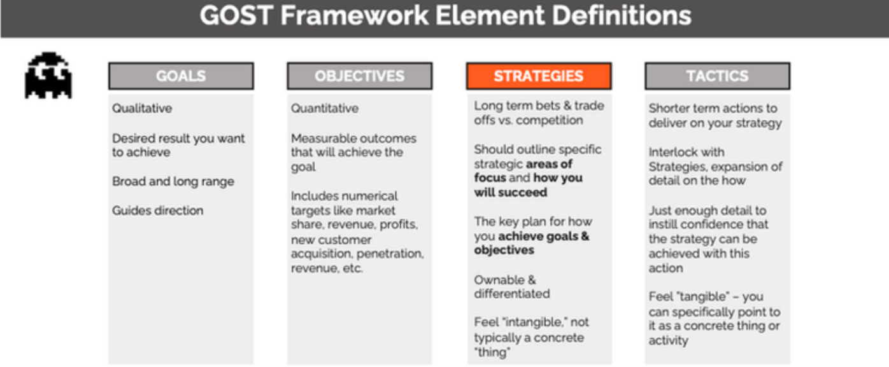

# Foundational

## Organizational Support

“Going it alone, you won’t last a day out there” – Sandor Clegane, Game of
Thrones

To launch and mature an effective threat hunting program, it is critical to have
buy-in for executive leadership and sometimes that can be a difficult
conversation to heave with leadership. A major security benefit form threat
hunting is that is offers the ability to verify assumptions about the design,
controls, and behaviors of a network but it also operates within a space that
assumes that existing security protections have failed. Security investments
continue to increase year over year so when approaching leadership to support
investing in a threat hunting team, consider the following guidelines.

Gaining the support of the chief security officer (CSO) or chief information
security officer (CISO) is critically important, and efforts should be made to
gain executive support beyond the security organizational boundaries. The more
executive support a threat hunting program can get the better. If a threat
hunting program does not gain executive support, the effectiveness and growth of
the program will be limited.

Depending on the organization, obtaining long term support from executives can
be challenging but demonstrating the value of threat hunting by showing how
threat hunting can help reduce risk, reduce dwell time, and enhance existing
security teams within the organization can help leadership understand the value
add and buy into the effort.

The following are some data points which can be used to gaining leadership
support:

-   If your organization has experienced any breaches, present dwell time,
    impact, and cost data associated with the breaches

-   Present third-party evidence related to the cost of data breaches

-   Present dwell time data from third-party resources

-   Compare recent penetration testing or red team exercise activities against
    existing security tooling highlighting the gaps in detections

-   Consider scheduling a compromise assessment and using the results as data
    point to highlight identified risks, threats, or lack of visibility

The following are some talking points to discuss with leadership regarding the
value-add of threat hunting:

-   Reduce the average time to detect threats

-   Increase the quality of automated detections to reduce alert fatigue and
    improve security operations

-   Ensure security controls are adequate

-   Reduce costly incident response activities

-   Protect intellectual property and brand reputation

Be prepared to submit an official proposal to start a threat hunting program
including an executive summary, justification, cost schedule and deliverables.
The following sections within this framework will be valuable resources in
developing the proposal:

-   Resources and Staffing

-   Data and Technology Audit

-   Metrics

It is quite ok to start small, demonstrate value, and then expand threat hunting
operations as the team provides value to the organization. Details regarding
short- and long-term goals and milestones should be included within the
proposal.

## Organizational Placement

While not a critical component to begin or run an effective threat hunting
program at an organization, the placement of the threat hunting team within an
organization can directly impact how well the value threat hunting is bringing
to the organization is communicated to leadership.

The placement of the threat hunting team may depend on the staffing model of the
threat hunting program. If threat hunting is going to be executed as a part time
function within an existing team obviously, changing the organizational layout
will be challenge however to maximize the effectiveness and growth opportunities
for a threat hunting program, it is best if the threat hunting team directly
informs security leadership such as the CISO or CSO. Directly communication
lines between threat hunters provides leadership direct, unfiltered input into
the state of security within the organization.

## Threat Hunting Definition

“Ask 10 security professionals for the definition of threat hunting and you’ll
get 11 answers”

Each organization that wants to launch or has a threat hunting program must
define what threat hunting means to the organization and that definition should
be driven by the mission statement of the threat hunting program. The OTHF is
not designed to act as the authority of what is or isn’t threat hunting because
threat hunting means a lot of different things to a lot of different people and
that’s ok. The only requirements regarding the definition of threat hunting that
the OTHF includes is:

1.  The organization should decide on and document the definition of threat
    hunting

2.  The definition of threat hunting should be driven by the mission statement
    of the threating hunting program

Considerations organizations should include when defining threat hunting:

-   Avoid hunting for activities that are already being detected by
    differentiating between proactive from reactive efforts

    -   If you define threat hunting as an activity that involves purposefully
        seeking out evidence of malicious activities within the environment that
        did not generate security alerts, the organization can avoid
        duplications of effort and maximize value add to the organization.
        Additionally, if an organization specifically calls out how threat
        hunting is a proactive approach to cybersecurity, it can eliminate
        confusion as to how threat hunting differs from incident response or
        security operations responding to an alert.

-   Describe threat hunting as a dedicated, repeatable process

    -   Threat hunting benefits from a methodical approach. From the threat
        hunters perspective, hunters will benefit from a disciplined approach to
        understand the threats applicable to the target environment, understand
        their respective techniques, tactics, and procedures, and then use that
        information to determine what clues to look for that might indicate an
        attack underway. Additionally, a well-defined process makes it easier to
        track improvements, increase collaboration, and provide quality control.

-   The value of including language to ensure threat hunting is based upon a
    hypothesis

    -   The main advantage of leveraging a hypothesis-based threat hunting model
        is that it ensures that a threat hunt is testable and provides
        guidelines to determine success or failure. Additionally, a hypothesis
        provides a clear statement of the question that the hunter intends to
        investigate. Without a hypothesis, a threat hunting can become unfocused
        and difficult to conclude any sort of concrete findings. There are
        activities within threat hunting that may not have a formal hypothesis
        such as generation observations on the behavioral data of systems or
        users within the network such as “I wonder how many users actually use
        PowerShell on a day-to-day basis?” however such observational research
        should be used to create a hypothesis-based threat hunt.

Example definitions of threat hunting:

-   Threat Hunting is a dedicated, continuous, hypothesis-based search
    methodology to reduce the time to detect adversaries operating within an
    environment that have yet to be detected.

-   “Threat hunting is the practice of proactively searching for cyber threats
    that are lurking undetected in a network”.[^1]

-   “Cyber threat hunting is a proactive security search through networks,
    endpoints, and datasets to hunt malicious, suspicious, or risky activities
    that have evaded detection by existing tools.”[^2]

-   “Threat hunting is the practice of searching for cyber threats that might
    otherwise remain undetected in your network.”[^3]

-   “"a focused and iterative approach to searching out, identifying, and
    understanding adversaries internal to the defender's networks.”[^4]

[^1]: https://www.crowdstrike.com/cybersecurity-101/threat-hunting/

[^2]: https://www.trellix.com/en-us/security-awareness/operations/what-is-cyber-threat-hunting.html

[^3]: https://www.checkpoint.com/cyber-hub/cloud-security/what-is-threat-hunting/

[^4]: https://www.sans.org/white-papers/who-what-where-when-why-how-effective-threat-hunting/

## Mission Statement

It is essential that organizations set the clear expectations, principles, and a
vision for the Threat Hunting Team. A mission statement is a critical component
to help communicate the purpose and direct the threat hunting program in the
right direction. The growth and success of the threat hunting program will be
dependent on short-, medium-, and long-term goals and the mission statement
provides an invaluable navigation tool to define and obtain goals. It is
important to note that a mission statement is not meant to be something used
during just the launch of the threat program but a navigational beacon that
provides direction as the program grows and matures. Additionally, a
well-constructed mission statement will help the team see the meaning and
purpose of their work by giving them clear reasons their job benefits a larger
goal. The best part about mission statements is that they can always been
changed. Do not be afraid to replace or revise your mission statement as your
threat hunting program grows and matures.

Consider the following example mission statement:

*To be the driving force in custom automated adversary detection targeting XYZ
.*

From this mission statement, the reader immediately understands that this threat
hunting program is focused on hunting for adversary activities and creating
automated detections specific to the organization so it’s reasonable to assume
that a big focus of this threat hunting program would be identifying and
understanding relevant adversaries and developing threat hunts that would
transition well to custom automated detections.

Here are some recommendations for building a mission statement for threat
hunting:

-   Keep it concise and do not exceed more than one or two sentences and

-   Consider including language to ensure that threat hunting is meant to
    compliment existing security teams, not replace them

-   Get feedback and include the team members in its development

-   It’s not important to include details into how goals will be achieved

-   Attempt to include components that align with the mission statement and core
    values of the overall organization

## Strategy

The strategy of a threat hunting program is a thoughtfully constructed plan or
approach that outlines how the program will achieve the mission. It’s worth
nothing that strategies play a role in how goals and objectives are accomplished
as well but for the purposes of this section, we will focus on strategy as it
relates to the program’s mission.

A well-crafted strategy provides a clear roadmap sets the tone of the actions
people in the organization should take and identify the priorities to achieve
the desired goals. It is important to note that a strategy is not a mission
statement. When applied properly a strategy will dictate how resources will be
allocated to accomplish the mission. Therefore, threat hunting organizations
should develop a mission statement first before developing a strategy for the
threat hunting program.

It is worth noting that an organization’s strategy is dynamic as it will
continue to change as it adapts to new goals and objectives. Strategies are
critical to the success of a threat hunting program because they are the driving
force behind creating the plans and actions to accomplish goals.

Figure 1: Setting up Threat Hunting Mission, Strategy, Goals and Objectives

### Goals and Objectives

Every threat hunt program, in fact every hunter, must have a goal in order to
succeed. A goal is the desired result that a program or hunter plans to
accomplish. Goals should be specific, realistic, and attainable and usually have
a deadline. Goals can either be short term or long term and can be any of these
types:

**Long-term goals:**

Big picture goals that often stretch over a significant amount of time and
require accomplishing short term goals to complete.

Example: Make the threat hunting program a leader within the security
organization

**Short-term goals:**

How long-term goals are broken down into manageable pieces. Short-term goals
tend to be easily measured and associated with a specific time period.

Example: Increase awareness of the value threat hunting will bring to the
organization

**Performance-based goals:**

Performance-based goals are associated with specific tasks or objectives that
are easy to measure or evaluate. Performance-based goals are often associated
with a specific time period.

Example: Migrate 100 threat hunts to automated detections by the end of Q1.

**Quantitative goals:**

Quantitative goals are directly associated on hard data such as percentages,
numbers, or statistics.

Example: Reduce SOC false positive triage efforts by 25% by redesigning existing
automated detections through threat hunting process.

**Qualitative goals:**

Qualitative goals are ones that are felt more than measured. The achievement of
qualitative goals are not based on hard data but on the impact on the
satisfaction and worth of the person or program.

Example: Improve relations between SOC and threat hunting team.

**Outcome-oriented goals:**

Outcome goals are centered on the end-results specifically stating what the goal
is designed achieve. Outcome goals do not detail how the end-result will be
achieved but rather states clearly what is to be achieved.

Example: Establish and implement a threat hunting process

**Process-oriented goals:**

Process goals are detailed plans of action and track the progress of steps taken
to advance. Process goals are about the way the threat hunt team does things,
not about the results.

### GOST Framework

The Harvard Business Review’s Robert Kaplan 95% of employees are unaware of or
do not understand their company’s strategy[^5] indicating that there is clear
disconnect between a company’s overarching strategic management plan and the
people who are meant to execute it. The GOST framework stands for Goals
Objectives Strategy and Tactics and provides a way to bring visibility and
clarity to what an organization is trying to do and how they are going to do it.

[^5]: https://pubmed.ncbi.nlm.nih.gov/16250626/

On a smaller scale, threat hunters should be aware of the overall strategy of
the threat hunting organization. When threat hunt teams do not understand what
the team is trying to accomplish, why it is important, and what is expected of
them it can result in confusion, decreased morale, and a lack confidence in
leadership.

Breaking down the GOST framework, you can see that there is a clear distinction
between the components of the framework in terms of what the team is trying to
accomplish and how they are meant to accomplish it.

Goals are what you want to achieve broadly, and they are qualitative. Objectives
are quantitative measurements or numeric targets that describe the specific
outcomes that define your goal such as marketing penetration, profit, and
revenue. Strategy is the high-level plan you will follow to achieve your goals
and tactics are specific actions you will take to achieve your goals.

Figure 17: GOST Framework[^6]

[^6]: <https://ebrary.net/116529/management/gost_framework>

Strategy Kiln GOST Framework[^7]

[^7]: https://www.strategykiln.com/post/gost-busters-goals-objectives-strategies-and-tactics-explained-with-an-amazon-example
