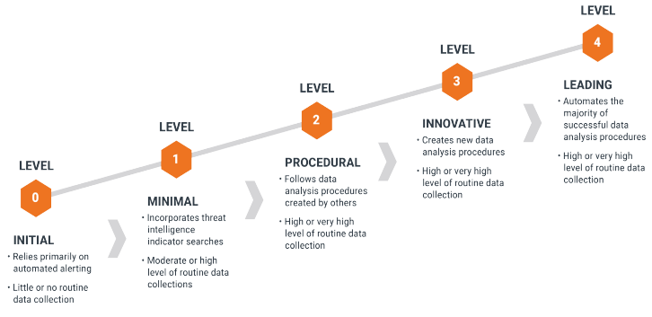

# Operational

Threat Hunting requires a methodical approach. However, it is important to
remember that -Threat Hunting is not a project (time bound activity). As
attackers keep evolving, threat hunters should create new detection mechanisms
and continuously refine existing ones to improve detections (i.e. reduce false
positives and automate). With the OTHF, threat hunt teams can have a continuous
improvement driven framework for threat hunting that is designed to scale to
support even the largest organizations by acting as the driving force behind
automated detections. This isn't the art of fiction. Over the years, the OTHF
team has worked rigorously to create a platform agnostic threat hunting process
and this framework and processes is the result of zeal for effective and
efficient threat hunting that will integrate with automated detection processes
such as Palantir' Automated Detection Strategy (ADS)[^1] and applying lessons
learned during incidents responded.

[^1]: https://github.com/palantir/alerting-detection-strategy-framework

Figure 3: Threat Hunting Framework

At its core, the framework lays out simple steps:

1.  Know the threats as applicable to your company and industry

2.  Understand TTPs for applicable threats

3.  Develop the Threat Hunt per unique TTP

4.  Automate developed Hunts

5.  Periodically revalidate the work – Threats, TTPs and Hunts.

Details below explain how Threat Hunter could benefit from those building blocks
and elaborates the process of Threat Hunting.

## Identifying Hunts

Every organization faces security risks, but the risks aren’t the same for
everyone. An attacker specifically targeting a hospitality organization, for
example, will likely go after different assets than an attacker specifically
targeting an electricity utilities company. Within the organization, targets may
vary. An attack on the accounting department might target financial data or
employees’ personal information, while an attack on the engineering department
might target intellectual property. Additionally, there are also threats that
are opportunistic in nature that are not targeting a specific industry or
organization but can pose as a significant risk.

This section of the OTHF is designed to help organizations identify and
prioritize hunts to maximize the value of the threat hunting program.

### Intelligence Driven

Much like with threat hunting, the OTHF is not meant to be a definite guide on
cyber threat intelligence (CTI), but it is important for a threat hunting
program to understand that CTI can be a major asset to identify and prioritize
threat hunts.

CTI provides crucial support by providing detailed information on
characteristics of previous attacks, common access vectors, and the techniques
and procedures that adversaries employ. Threats are characterized by types of
attackers, common points where an infection might occur, and the procedures
attackers are likely to employ. Understanding the steps attacker may take,
allows the threat hunter to define the potential clues of malicious behavior
aligned with the attack stages.

While having a dedicated CTI team to help identify and prioritize activities for
the threat hunting program is ideal, the OTHF will cover approaches that can be
adapted by organizations of varying levels of maturity.

The OTHF focuses mostly on two types of threat intelligence:

-   Strategic Threat Intelligence (STI) – High level analysis of adversary
    motivations, abilities, and associated targets. STI is not focused on the
    technical details of how an attack will happen but rather this intelligence
    will shed light on why adversaries attack and who they may target.

Tactical Threat Intelligence (TTI) – Detailed analysis of the TTPs associated
with an adversary or malware family. TTI analysis may include multiple reports
for adversary groups or malware families which describe the how an attack will
happen through each of its various stages.

### Strategic Threat Intelligence Sources

In more mature organizations, an internal or third-party CTI team should be
leveraged for the latest intelligence on which adversaries are actively
targeting or most likely to target an organization and would be the underlying
motivation for the attack.

If the threat hunting team has access to a dedicated CTI team, the threat hunt
program should coordinate with the CTI team to receive regular updates on
adversary activities and motivations. The threat hunting program should be able
to identify the top threats to the organization at any given time through a
relationship with the CTI team.

If an organization does not have a dedicated CTI team, threat hunting programs
can leverage several free sources to gather STI data including a mapping
adversary groups to targeted industries and motivations.

#### Electronic Transactions Development Agency

The Electronic Transactions Development Agency (ETDA) maintains a Threat Actor
Encyclopedia containing numerous threat actor groups. Within each entry, users
can find a description of the adversary, suspected country of origin, targeted
sectors and countries, and motivation. Additionally, where applicable the ETDA
populates a “Operations Performed” section detailing attacks that have been
attributed to the adversary.

Every threat actor “card” can be downloaded as a PDF or JSON object.

ETDA Threat Actor Encyclopedia: <https://apt.etda.or.th/cgi-bin/listgroups.cgi>

Figure 4: ETDA Threat Intelligence on FIN7

#### The MITRE ATT&CK Groups

MITRE maintains a Groups page within the ATT&CK framework that provides an
overview of adversary groups and the industries they frequently target. MITRE
classifies a group as “sets of related intrusion activity that are tracked by a
common name in the security community”[^2]. While the level of STI gathered from
MITRE Groups may not be as detailed or targeted as what a dedicated CTI team
will produce, threat hunters can leverage the resources within MITRE Groups to
identify which adversaries are associated with their organization’s industry and
check the references for attributed attacks against parent companies,
subsidiaries, or geolocations.

[^2]: https://attack.mitre.org/groups/

MITRE ATT&CK Groups: <https://attack.mitre.org/groups/>

Figure 5: MITRE ATT&CK Threat information on FIN7

#### Other Sources

Secureworks Threat Profiles:
<https://www.secureworks.com/research/threat-profiles>

Mandiant Advanced Persistent Threat Groups:
<https://www.mandiant.com/resources/apt-groups>

### Tactical Threat Intelligence

In more mature organizations, an internal or third-party CTI team should be
leveraged for the latest intelligence on mapping adversaries and malware to
specific tools, tactics, and procedures. If a dedicated CTI team is available to
the threat hunting program, the CTI team should be consistently maintaining a
TII resource and make it available to all threat hunters.

If an organization does not have a dedicated CTI team, threat hunting programs
can leverage several free sources to gather TII to gather intelligence on the
TTPs leveraged by various adversaries and malware.

#### The MITRE ATT&CK Tactics and Techniques

MITRE provides a comprehensive library of adversarial tactics and techniques. A
globally accessible open-source knowledge base, it incorporates a detailed list
of offensive tools and techniques that hunt teams can draw from when
constructing hypotheses. The framework also includes a detailed list of which
data sources should be examined a specific technique in an environment.

For the techniques defined in MITRE ATT&CK framework has a “Data Sources” field
in the reference box to the right which explains what Data Sources are
recommended for the detection of the specific technique.

Figure 6: The MITRE ATT&CK Framework TTPs

MITRE also maintains an ATT&CK Software repository which details malware and
tools used

MITRE provides a comprehensive library of adversarial tactics and techniques. A
globally accessible open-source knowledge base, it incorporates a detailed list
of offensive tools and techniques that hunt teams can draw from when
constructing hypotheses. The framework also includes a detailed list of which
data sources should be examined a specific technique in an environment.

For the techniques defined in MITRE ATT&CK framework has a “Data Sources” field
in the reference box to the right which explains what Data Sources are
recommended for the detection of the specific technique.

#### Electronic Transactions Development Agency

The Electronic Transactions Development Agency (ETDA) maintains a Threat Actor
Encyclopedia containing numerous threat actor groups. Within each entry, a
“Tools used” section is populated with tools that have been associated with the
adversary. Each tool within the ETDA encyclopedia contains information
describing tools capabilities, uses, and links to other reports associated with
the tool.

Every tool “card” can be downloaded as a JSON object.

ETDA Threat Actor Encyclopedia: <https://apt.etda.or.th/cgi-bin/listgroups.cgi>

Figure 7: ETDA Tactical Intelligence

### Threat Assessment

Threat assessment is a proactive activity to help an organization understand
their specific risks by gaining insight into what adversaries may be targeting
them and how the attack may happen. Threat assessments, blend data from STI and
TTI and through this exercise a threat hunting program can identifying hunts
that are relevant to an organization and can have a positive impact on the
organization’s level of risk.

Threat assessments should take a methodical approach and depending the resources
available to the threat hunting program, portions of a threat assessment may be
based on assumptions or best guesses. As a threat hunting program matures, the
accuracy of the threat assessment should improve based on improved STI, TTI, and
understanding of the organization.

-   First step is to use the available resources to gather STI to identify
    threats that are applicable to your organization. Understand these
    adversaries and their evolving methodologies.

-   Research and understand the identified adversaries. Analyze the threat
    groups’ motivations, to assist you in crafting a narrative of threats to
    your organization

-   Based on the motivations and methodologies of the adversaries, understand
    the basic level of potential impact to the organization. This section is not
    meant to include a full impact assessment but rather gives hunters and
    opportunity to prioritize hunts based the severity of different style of
    attacks.

-   Research and understand the tools, techniques, and procedures associated
    with the adversary to build a narrative about how each adversary carries out
    an attack

-   Based on the capabilities and tools/techniques of adversaries, combined with
    your knowledge of security controls determine the likelihood of the attack.

Most organizations have finite resources and budget. It may be practically
impossible to address every identified threat group based on available
resources. Prioritization is key. Threat hunting programs can leverage the
threat assessment process to identify hunts that will provide the most value to
the organization.

Figure 8: Threat Assessment Process

**MITRE Navigator**

MITRE Navigator is a free tool that enables users to efficiently use the data
within the ATT&CK framework. Navigator enables users to create layers upon the
ATT&CK matrix and automatically annotate techniques that are applicable to the
defined layer.

Navigator allows threat hunters to quickly query the ATT&CK data set to
highlight associated tactics and techniques associated with group, software,
data sources, and mitigations.

Figure 9: Threat Assessment using MITRE Navigator

#### Vulnerability and Exploit Data Driven

According to NIST, a vulnerability is a weakness in a system, system security
procedures, internal controls, or implementation that could be exploited or
triggered by a threat[^3].

[^3]: https://nvlpubs.nist.gov/nistpubs/SpecialPublications/NIST.SP.1800-17.pdf

Vulnerabilities are just a reality that all security teams must accept. Every
year, a vast number of new vulnerabilities are discovered and made public, and
organizations must constantly assess and patch vulnerabilities. Patch management
has continually been a challenge for organizations and within the time where a
vulnerability is released and a patch is successfully applied, organizations are
at risk from additional threats. During this window of vulnerability, threat
hunting teams can provide some risk mitigation coverage by executing threat
hunts for evidence that the vulnerability has been used as part of an attack.

Typically, a vulnerability disclosure does not contain enough information for
threat hunters to successfully execute a hunt for an associated attack. There is
a significant difference between something being vulnerable and something being
exploitable. Exploits are pieces of code or sequences of instructions that take
advantage of a vulnerability to cause an unintended behavior, gain unauthorized
access, or execute arbitrary additional commands.

While a vulnerability details a theoretical way to execute an attack against
exploits provide a direct path for an adversary to take advantage of a
vulnerability in an attack. To help threat hunting teams identify and prioritize
threat hunts associated with vulnerabilities, the OTHF encourages threat hunting
programs to implement a similar triage process:

Figure 10: Vulnerabilities and Exploits Driven Hunts

-   Vulnerability – A vulnerability is released

-   Applicable to Org – Is the vulnerability associated with software, hardware,
    or other system that is used within the organization?

-   Exploitable – Has there been an exploit released or has it been exploited by
    an adversary in the wild?

-   Exploitability – How difficult is exploitation?

    -   Is the vulnerability associated with software or systems that are
        publicly available?

    -   Does it require preexisting physical, network, or authentication access
        to be successful?

    -   Are there existing security controls that mitigate the exploit?

-   Impact – What is the level of impact to the organization if an attacker
    successfully exploits the vulnerability?

-   Hunt

**Vulnerability and Exploit Data Sources**

Exploit DB - project maintained by Offensive Security which is a collection of
public exploits and vulnerable software.

<https://www.exploit-db.com/>

Rapid7 Vulnerability and Exploit Database – Repository of vetted software
exploits and exploitable vulnerabilities.

<https://www.rapid7.com/db/>

CXSecurity – web-based application containing the latest exploits for local and
remote vulnerabilities.

<https://cxsecurity.com/exploit/>

#### Attack Surface Driven

NIST defines an attack surface as “The set of points on the boundary of a
system, a system element, or an environment where an attacker can try to enter,
cause an effect on, or extract data from, that system, system element, or
environment.”[^4]. Attack surface discovery (ASD) is a continuous process aimed
towards discovering, categorizing, and evaluating the security of an
organization’s cyber assets. Where ASD differs from asset or vulnerability
management is that ASD can be considered the aggregate of assets,
vulnerabilities, mitigations, and controls to present an organization with a
contextualized view of how areas within the network that an attacker could be
successful.

[^4]: https://doi.org/10.6028/NIST.SP.800-171r2

Threat hunters can leverage ADS to identify and prioritize hunts for threats
that are directly associated with the available attack surface of an
organization. Leveraging ASD data to identify hunts, ensures that hunters are
focused on threats that are most likely to be successful against their
organization.

In the paper, “A Threat-Driven Approach to Cyber Security” [^5] M. Muckin and S.
Fitch propose a relational model between threats, assets, and controls. Through
this model, Muckin and Fitch demonstrate that adversaries rarely directly access
targeted cyber assets, instead they interact with and circumvent other
components of a system to obtain their objectives. Muckin and Fitch go onto
state that given an indirect relationship between adversaries and targeted
assets, “controls must be selected and implemented to address threats and attack
vectors” where a control is a direct response against relevant threats and
attack vectors that exist within a given system or application.

[^5]: https://www.lockheedmartin.com/content/dam/lockheed-martin/rms/documents/cyber/LM-White-Paper-Threat-Driven-Approach.pdf

Threat hunters can leverage threat intelligence as an input into a
Threats-Assets-Controls Relational Model to identify potential areas of exposure
and attack vectors are highlighted which can drive identification of relevant
hunts for a particular system or application.

Figure 11: Muckin, Fitch Threats, Assets and Controls Relationship Model

#### Mission Driven

The delivery of the core operations while maintaining data security of those
operations can be considered the missions of the organization. Outside of using
threat intelligence to identify threat hunts, threat hunt programs may also
choose to perform threat hunts based on ensuring mission assurance by focusing
threat hunting efforts to detecting adversaries as they attempt to compromise
mission relevant systems, services, users, protocols, devices, networks,
processes, or data (cyber assets).

To fully understand and reduce the risk of impacting core missions, threat
hunters must execute mission mapping and threat modeling exercises to
identifying underlying cyber assets that enable the organization’s missions.

The idea behind mission driven threat hunting is based upon K. Jabbour and S.
Muccio, “The Science of Mission Assurance,[^6]” where a four-step process is
outlined for cyber mission assurance.

[^6]: K. Jabbour and S. Muccio, “The Science of Mission Assurance,” Journal of
    Strategic Security, vol. 4, no. 2, pp. 61–74, 2011.

1.  Develop and prioritize a list of mission essential functions

2.  Mission mapping to identifying all dependencies a mission has on cyberspace

3.  Identify vulnerable assets

4.  Analyze risks and mitigate.

For mission driven threat hunting, hunters should take a similar approach:

1.  Identify and prioritize core operations

2.  Perform mission mapping to identify all mission dependent systems, services,
    and data

3.  Perform a threat model of dependent systems, services, and data

4.  Identify and prioritize hunts to detect identified threats for identified
    mission dependent systems, services, and data

The value of mission driven threat hunting is that hunters are prioritizing
hunts based on a deeper understanding of what cyber assets are supporting
missions and how an attack on them impacts the overall risk to the organization.

**Mission Mapping**

It is not uncommon for threat hunters or even the IT administrators to not fully
understand all of the dependencies and interconnections of cyber assets that
enable missions. Mission mapping aims to address this issue by actively building
understanding of all of the complex relationships between cyber assets and their
relation to missions.

There are various methods to perform mission mapping, but the methods drawn from
J. Guion and M. Reith’s “Cyber Terrain Mission Mapping: Tools and Methodologies”
including Functional Mission Analysis, Crown Jewels Analysis, Ontology Modeling,
and Impact Dependency Graph were all specifically designed for use by
cybersecurity personnel to identify cyber key terrain.

It should be noted that some of the aforementioned mission mapping methodologies
are highly effective but require a significant amount of effort and supporting
software to build out and maintain. As threat hunting organizations mature, they
may opt to implement one of the methods from “Cyber Terrain Mission Mapping:
Tools and Methodologies” that factor in quantitative data.

For the purposes of the OTHF, the framework will focus on Ontology Modeling
which leverages an entity-relationship-attribute (ERA) diagram to create an
easy-to-understand mission map modeling the relationships between missions,
users, capabilities, and assets.

It is not a requirement for any threat hunting program to implement a defined
mission mapping standard, some organizations may opt to identify key missions
and model their cyber asset dependencies through a tree graph, with the mission
at the top and connecting dependent systems, software, users, networks, and
physical infrastructure in a hierarchal manner.

**Ontology Modeling**

In the paper, “CAMUS: Automatically Mapping Cyber Assets to Missions and
Users”[^7], Goodall, D’Amico, and Kopylec from Applied Visions Inc outline how
they translated ERAs into a ontology models for automated mission mapping using
a custom tool named CAMUS.

[^7]: https://securedecisions.com/wp-content/uploads/2011/06/Camus-Automatically-Mapping-Cyber-Assets-to-Missions-and-Users.pdf

The resulting mission mapping models leveraging the ERA approach results in a
nodal graph where relationships are defined as “uses”, “depends on”, and
“requires”. Through this approach threat hunters are able to traverse the graph
and ask, “What cyber assets are needed to execute my mission”, or the bottom-up,
“what missions are impacted by the loss of this system”[^8].

[^8]: L. Buchanan, M. Larkin, and A. D’Amico, “Mission Assurance Proof-of-Concept:
    Mapping Dependencies

    among Cyber Assets, Missions, and Users,” in IEEE International Conference
    on Technologies for Homeland Security (HST), 2012, pp. 298–304.

**Example of Ontology Model**

In this simple example, we demonstrate an organization who has a core business
component (mission) of “Receiving Orders”. User the ERA approach, threat hunters
can identify and build threat hunts around proactively identify threats that
would impact the cyber assets that the support Receiving Orders mission. Threat
hunters may need to fuse vulnerability and attack service data with the ontology
model to design a threat hunt for applicable threats for the identified cyber
asset.

Figure 12: Ontology Model Example

#### Observation Driven

As hunters get access to data, they may observe new trends, patterns in user or
system behavior, or identify pieces of data that seem like anomalies compared to
current and historical knowledge of the datasets. These observations can be a
valuable driver in developing new threat hunts and provide an opportunity for
threat hunters to leverage their unique understanding of the environment along
with their creativity to identify threat hunts unique to their organization.

While observations may be obtained through unstructured mechanisms, hunters
should use their observations to formulate a structure hunt.

The following process is meant to demonstrate how observations can drive a
threat hunt.

1.  While performing research within the network connected process data set, a
    member of the hunt team notices a process named “certutil.exe” making a
    network connection to an IP address 192.168.1.1

2.  The hunter has never observed “certutil.exe” within the network connected
    processes data set.

3.  The hunter performs a historical search for “certutil.exe” within the
    network connected process data and determines that this event is not an
    anomaly and occurs regularly within the environment.

4.  The hunter does some research about why certutil.exe would establish a
    network connection for legitimate and malicious reasons.

5.  Triaging the current and historical events, the hunter determines that this
    certutil.exe activity is legitimate

Hunter creates a hypothesis to hunt for malicious network connected certutil.exe
events.

## Threat Hunting Process

One of the most important elements to implement when operationalizing a threat
hunting program is structure. Structure ensure that hunters remain task-driven,
adhere to well-defined standards, and focused on activities that bring value to
the organization. Without structure, hunt teams’ risk executing hunts within a
disorganized and disjointed environment which creates an extremely difficult
situation to demonstrate the value of threat hunting or track improvements.

In terms of threat hunting structure, a well-defined threat hunting process is
critical for setting up the threat hunting program for success and can prevent
inefficient or ineffective hunts from devaluing the threat hunting program. The
threat hunt process should be considered the authoritative resource for design,
documentation, and quality standards for threat hunts.

It is important to note that there are various different threat hunting
processes available, the OTHF team has developed a threat hunting process for
everyone to use but organizations may choose to pick a different one like the
TaHiTI process.

### OTHF Hunting Process

Figure 13: OTHF - Threat Hunting Process

The OTHF process shows the high-level building blocks of Threat Hunting. The
process should be applied for each unique threat and TTP identified. Each Threat
Hunt should be defined and executed as a project with clear scope in mind aka
Threat Hunting goal.

Figure 11: Detailed Threat Hunting Process- provides a detailed project overview
and workflow. We explain the process in the text below.

Figure 14: Detailed Threat Hunting Process

#### Define a Threat Hunt Goal

“If you don’t know where you’re going, any road will get you there.”[^9]

[^9]: Quote by Lewis Carroll

Having direction is very important in threat hunting. Not having direction, a
goal, or not knowing where your hunt is going, it’s all the same. You go
nowhere. You can never get “there,” because you don’t really have a destination.
Without direction, without a goal, threat hunts will suffer to determine success
and risk being ineffective.

Rather than generally searching for various types of threats, threat hunter
should start by defining a specific, narrowly focused goal. The goal can be
created based on any hunt identification methods listed in the Identifying Hunts
section of the OTHF as well as any additional methods not listed however, threat
hunting programs should define standards and best practices for goal
development.

**SMART Goals**

SMART is a widely accepted criteria for individuals and organizations to set
goals and objectives. SMART is an acronym that stands for specific, measurable,
achievable, relevant and time-based.

**Specific** - Goal should be well-defined, clear, with unambiguous intentions

Goals that are specific have a significantly greater likelihood of being
accomplished and a popular approach to designing a specific goal is to
incorporate answers to the popular “W” questions.

Who – Consider who is required to accomplish the goal? Who will be responsible
for executing and a dependency for success?

What – What exactly are you trying to accomplish? Details matter and it pays to
be hyper focused when goal setting.

Where – Location specific details may not always be relevant to a goal but if
there is a location or trigger that is relevant to the goal, it should be
stated.

Why – Why are you trying to accomplish this goal? Why is it relevant to the
organization? How does it incorporate with the organizations overall mission
statement, goals, and objectives?

**Measurable** – Progress towards accomplishing the goal should be easily
determined through defining specific criteria for measuring success.

Goals should have criteria for measuring progress and success. If there are no
metrics defined than how will you determine if you’ve accomplished your goal or
how close to completion are you?

**Achievable** – The goal should be attainable and not impossible to accomplish.

Goals are meant to enable progress not to discourage it. When setting goals,
ensure that they are attainable and there are no major roadblocks like the lack
of skills or tools to accomplish the goals.

**Relevant** – The goal should align with the broader goals and mission
statement of the organization

Goal relevance refers focusing on something that makes sense within the scope of
the organization’s vision and mission. A goal that is designed to address an
issue that is not relevant to the organization is not adding value.

**Time-Based** – The goal should be bound by a timeframe including a target date
for completion.

The best goals in the world can be ruined through inaction therefore including
time elements such as deadlines or intervals adds layers of accountability and
urgency increasing the likelihood of success. Additionally, including Time-Based
along with Measurable criteria within a goal can help you define what should be
achieved at throughout the goal’s lifespan.

#### Develop Hypothesis

Hypothesis is a testable statement about the proposed explanation for some
observed phenomenon[^10]. The foundations of a strong threat hunt hypothesis are
relevance and testability. Relevance has been already explained above, it means
how does the hypothesis relate to organizational needs, current industry trends,
and available data sources. Testability means that the data and tools available
would provide some chance of finding what the threat hunter is looking for
within the hypothesis. That means, a good hypothesis is a question that helps
you identify threats, gain information about your environment, or prove your
hypothesis wrong or right. Not all these goals need to be met, however,
hypothesis should always have a conclusion, whether it is proven right or
wrong[^11].

[^10]: https://whatis.techtarget.com/definition/hypothesis

[^11]: https://www.cybereason.com/blog/how-to-generate-a-hypothesis-for-a-threat-hunt-techniques

As Paul C. Price, Rajiv Jhangiani, I-Chant A. Chiang, Dana C. Leighton, and
Carrie Cuttler detail in their work “Developing a Hypothesis”, hypotheses always
have an if-then relationship so threat hunters can structure their hypothesis
with an if-then format to ensure they are crafting a craft a testable and
measurable hypothesis.

Additionally, threat hunters can implement a “If..then” or “Given, When, Then”
notation to their hypothesis to help ensure that it contains the core components
of a strong hypothesis.

**Given When-Then**

Developed by Daniel Terhorst-North and Chris Matts as part of Behavior-Driven
Development (BDD)[^12], Given-When-Then is a notation style of representing unit
tests.

[^12]: https://martinfowler.com/bliki/GivenWhenThen.html\#footnote-ivan

Given-When-Then instructs users to break tests down to three sections:

-   Given is meant to describe the context of the scenario or pre-conditions of
    the test.

-   When is the triggering event or condition to test

-   Then describes the resulting outcomes or changes you expect due to the
    specified behavior.

Within threat hunting, the given-when-then framework ensures that hunts are
designed with testability and context to drive specifics.

**Example**

**Given** a Microsoft Exchange CAS is vulnerable to CVE-2021-26855 &
CVE-2021-27065, **when** a remote adversary leverages the ProxyLogon RCE module
within Metasploit to establish

#### Validate Data

Leveraging the knowledge gained through generating signal data, threat hunter
should validate that the requisite data is available (logged and retained) and
accessible to the threat hunt team to conduct searches. Better data quality
leads to better decision making. Therefore, Threat Hunter should:

1.  Document what data is needed: Identify what data is required to test the
    hypothesis. If you don’t know where to start, as explained above, MITRE
    ATT&CK Framework provides a starting point by identifying data sources
    relevant to the techniques. Your Threat Intelligence team may offer you
    greater depth of details on techniques and data sources required based on
    their analysis and research.

2.  Identify what is available: The data availability really means that quality
    data is available. Quality of data is essential in getting good and
    consistent results. The quality of the data should be validated based on
    following criteria:

    1.  Availability: The environment may not be setup to provide you the data
        you need to conduct the hunt. If the data is not captured or logged and
        retained, Threat Hunt team should coordinate to get the data required
        for analysis.

    2.  Completeness: The systems and tools may be configured to capture the
        data needed for threat hunt. However, the environment may not be
        configured consistently to provide required data e.g. data may be
        available on 50% of the end points – would hamper the quality of
        analysis and decision derived. Therefore, Threat Hunter must determine
        the minimum criteria to proceed and adjust.

    3.  Consistency: A data item(s) should be consistent in its content and
        format. If data isn’t consistent, different groups may operate under
        different assumptions and skew the decisions.

    4.  Retention: Also referred as timeliness of the data. Data should get
        recorded as soon after the real-world event as possible. Data that
        reflects events that happened more recently are more likely to reflect
        the current reality. Data retention rules established in the
        organization can severely impact the ability to conduct effective hunts.

If Threat Hunt team identifies any quality gaps explained above, the project has
already identified security gap. Threat Hunter can report these findings to fix
data availability or refine the hypothesis to work with available datasets.

Roberto Rodriguez provides a fantastic overview of the importance of data
validation in terms of threat hunting operations in his blog, “Ready to hunt,
First, Show me your data!” [^13]. In his blogpost, Rodriguez states “if data
needed for a hunting engagement does not meet specific requirements defined by
the hunt team, then the data is not considered quality data” meaning that all
the data in the world will not necessarily advance threat hunting operations if
it is not properly curated to ensure the highest data quality.

[^13]: Ready to hunt? First, Show me your data! -
    <https://posts.specterops.io/ready-to-hunt-first-show-me-your-data-a642c6b170d6>

Before an organization can begin an effort to ensure that that threat hunting is
using high quality data, organizations must first define a mechanism to measure
data quality. Organizations have various options when choosing a strategy to
measure data quality one example of a well-define data quality management
solution is the [DoD Total Data Quality
Management](http://mitiq.mit.edu/ICIQ/Documents/IQ%20Conference%201996/Papers/DODGuidelinesonDataQualityManagement.pdf).

Once an organization has established criteria and a measurement function to
evaluate the quality of their data, they should implement a well-define data
modeling strategy to provide specific guidelines regarding data modeling so as
new data is created, it adheres to a standard which produces high quality data.
One such approach is the [Common Information Model
(CIM)](https://www.dmtf.org/standards/cim).

**DOD Total Data Quality Management (TDQM)**

Built upon existing total quality management approaches, DoD’s TQDM process was
designed as a process to support database migrations and promote the adoption of
data standards amongst databases throughout the DoD. Through the TQDM process,
the DoD has created a list of characteristics that threat hunt teams can use to
quantify the quality of their data.

| Characteristic | Description                                                                                                                                                                                 | Example Metric                                                                                                                       |
|----------------|---------------------------------------------------------------------------------------------------------------------------------------------------------------------------------------------|--------------------------------------------------------------------------------------------------------------------------------------|
| Accuracy       | Accurate data is free of errors and that can be used as a reliable source of information. Additionally, a qualitative assessment exists where fewer errors results in a higher assessment.  | Percent of stored values that are correct when evaluated against the actual value.  Example, Species=Cat when the subject is a cat.  |
| Completeness   | The degree to which values present in the expected fields.                                                                                                                                  | Measurement of the number of fields that contain data vs the total number of fields.                                                 |
| Consistency    | The measurement of variance a set of data adheres to a defined set of constraints                                                                                                           | Percentage of values that match in type and structure across tables, files, and records.                                             |
| Timeliness     | The speed in which values are up to date within a data set.                                                                                                                                 | Percentage of entire data set that is available within a specified time frame.                                                       |
| Uniqueness     | The measure of the variance within the records of a dataset.                                                                                                                                | Perfect of database records having a unique primary key                                                                              |
| Validity       | The level of to which values are aligned with a defined classification and domain.                                                                                                          | Percentage of values within a dataset that adhere to their allowed values specified by their domain/classification.                  |

Table 1: DoD Core Set of Data Quality[^14]

[^14]: <http://mitiq.mit.edu/ICIQ/Documents/IQ%20Conference%201996/Papers/DODGuidelinesonDataQualityManagement.pdf>

**Common Information Model**

Common Information Model (CIM) standard is a project maintained by
[DMTF](https://www.dmtf.org/) that defines how information systems, networks,
applications, and services are managed while allowing for extensions through
third party vendors.

The CIM standard includes a management schema, a specification, and a metamodel.

Management Schema – Structured into the distinct components: core model, common
model, and extension schemas, the management schema supplies a well-defined
framework of interrelated systems and their properties and associations.

Specification – Enables integrations with other management systems by providing
definitions and syntax specifications for various systems to communication using
a common domain.

Metamodel – Defines expressions for common elements that must be clearly
presented to management applications (for example, classes, properties, methods,
and associations).

A practical application of a common information model for threat hunting can be
found with Splunk’s [Common Information
Model](https://docs.splunk.com/Documentation/CIM/5.0.1/User/Overview). While
Splunk’s CIM is designing within the Splunk platform, the underlying concepts to
implement data normalization and validation can be applied across various data
types and platforms.

#### Create Test Data

This step refers to the process of creating test data based on the techniques
adopted by the adversaries. Generating test data that is a direct result of the
targeted technique used by adversaries is a critical step in validating that the
hypothesis is accurate and requisite data is available. It is recommended to
spin up a lab environment before to test these configurations, scripts, or
subscriptions before finalizing the hunt for production deployment.

While recreating adversary operations with full featured offensive toolsets and
command control infrastructure would be ideal for creating test data, several
open-source tools exist that can help threat hunters generate signal data
through actions associated with adversary techniques.

As the threat hunting team gains efficiency, team may lose valuable time
orchestrating the test data. To overcome this inefficiency, organizations must
expand the charter of management and development of test data to improve
automation. This concept is well known as data-driven testing. The Red Canary
team has maintained an open-source detection testing framework called Atomic Red
Team[^15]. It is a library of tests mapped to the MITRE ATT&CK® framework.
Security teams can use it to reproducibly test the environments. As explained
above, MITRE ATT&CK framework is a taxonomy of threats that attempts to describe
the many techniques that an adversary might use when attacking an organization.
In that context, Atomic Red Team can be referred as a collection of tests for
emulating those adversary techniques.

[^15]: Atomic Red Team - <https://github.com/redcanaryco/atomic-red-team>

As threat hunting and detection methods mature, organization should consider
leveraging red team services to generate signal data for more advance TTPs.

Threat hunters need to analyze the data sources to prove or disprove a given
hypothesis using multiple forms of evidence. Hunters should also document where
the data comes from, ensuring that sources are both contextualized and
consistent.

#### Define Hunt Strategy

In this stage threat hunters should design the conditions to target within the
identified data source to identify adversary activity quickly and accurately.
Threat hunters should use this stage to establish a baseline of what is normal
for the given activities they are analyzing within the environment and should
have a good understanding of what data patterns are present within the targeted
data sources. Threat hunters should compare benign entries versus the signal
data to understand the differences to target, so the hunt activity is hyper
focused on only on adversary activity. A well-designed strategy can reduce
false-positives and increase the hunt efficiency.

#### Validate the Hunt

The validation stage of the framework is a chance for the hunter to test their
hunt strategy across a large set of data and may require a iterative process to
ensure a threat hunt is ready for production.

Hunt validation requires the hunter to execute the hunt against data over time
incorporating as much historical data as possible to test the hunt’s
signal-to-noise ratio[^16]. As results of the hunt are received the hunter
should evaluate the data and tune the conditions of the hunt to eliminate false
positives or modify the hunt strategy as needed.

[^16]: <https://en.wikipedia.org/wiki/Signal-to-noise_ratio>

Figure 15: Iterative process of Hunt Validation over range of historical data

#### Document Findings

The final step is to ensure the goal, hypothesis, TTPs, and searches are
methodically documented.

“If it isn't written down, then there is no evidence that it did or did not
occur.”

Documentation encourages knowledge sharing, which empowers your hunt team to
understand the fundamentals of what data a hunt returned and whether it was
successful. Without documentation, threat hunting organizations will lack
cohesion, become inefficient, and ineffective.

At the conclusion of every hunt, the hunter should document the date and time of
the hunt and any all findings. Findings can be interesting observations, missing
data, false positives, true positives, policy violations, or other data that
helps hunters better understand their environments.

### TaHiTI Hunting Process

https://www.betaalvereniging.nl/en/safety/tahiti/

## Hunt Tempo

Threat hunts could be triggered by different security initiatives such as:

-   New threat intelligence data – e.g. new threat actor, updates to the TTPs
    from known threat actor(s).

-   Cybersecurity Incidents: findings from cybersecurity incidents or lessons
    learned

-   Vulnerabilities reported after red team exercises / penetration testing

-   Findings from tabletop exercises: tabletop exercises are excellent way to
    explore some process and data deficiencies for cybersecurity incident
    investigations.

-   Other threat hunts: Threat hunt may result in findings that may trigger
    additional hunting projects.

-   Identification and analysis of Crown jewels: The crown jewels could be
    critical processes, assets, or data, if compromised; may result in severe
    consequences.

-   Threat modeling: Threat modeling is process that allows organizations to
    identify, enumerate and prioritize the threats based on the absence of
    security controls for the system.

-   Regulatory requirements: new or changes in regulatory requirements may
    influence the need for new hunts. E.g. Changes in detection and reporting
    regulatory requirements could provide feed in hunt backlog.

It is important to keep the backlog of threat hunt ideas so that team can
prioritize and schedule.

### Prioritization

With finite resources within the team, it is essential to prioritize the hunts.
The prioritization should depend combination on factors as :

1.  The TaHiTI[^17] (**T**argeted **H**unting **i**ntegrating **T**hreat
    **I**ntelligence) is a threat hunting methodology that focuses on the top 3
    layers of the pyramid of pain – TTPs, Tools, and Network / Host Artifacts.
    The hunts based on the lower three layers are based on the information
    received from the past attacks and campaigns – e.g. known bad domain names,
    IP addresses and hashes. Although important, the targeted attacks with same
    IOCs may not be a best use of the threat hunt team. Therefore, as team gains
    maturity, should focus on (or prioritize) top three layers of the pyramid as
    it can yield high value.

2.  Other factors: Apart from general prioritization addressed above as per
    TaHiTI, following factors should be used for prioritization based on its
    importance.

    1.  Regulatory Requirements: these could allow organizations to maintain
        their license to operate. Therefore, organizations must prioritize these
        if requirements change or new requirements for detection and reporting
        are imposed.

    2.  Historical Security Incidents: Historical incidents provide important
        data points for hunts because those are successful violations of
        security controls and policies.

    3.  Vulnerabilities reported after red team exercises / penetration testing:
        like historical security incidents, the pen tests or red team exercises
        provide the TTPs that have been successful.

    4.  Risk evaluations of threat hunt ideas: Each threat hunt idea should be
        evaluated for the risks to the business. If risk to the operational
        continuity, safety of employees or community, financial or reputational
        status of the organization is sever, team must prioritize

    5.  New Threat Intelligence data: Threats may go dormant or may choose to
        hibernate for a period. New Threats may emerge or dormant threats may
        suddenly become active again. The prioritization of threat hunts may get
        influenced due to this.

        1.  A potential threat is more likely to have more impact if it involves
            observations supporting many different hunting hypotheses. These
            threats and TTPs should be prioritized above other hunts.

        2.  The absence or downward trend of threat activities does not
            guarantee that organization won’t find it in their environment.
            Organizations may tend to deprioritize those hunt ideas.
            Reprioritization of those hunts could be considered. However, those
            should not be removed from backlog.

[^17]: <https://www.betaalvereniging.nl/en/safety/tahiti/>

### Scheduling

Within any organization scheduling is a major pain point, simply because amount
of time needed to build the schedule, manage employee availability and other
organizational constraints. In the threat hunt organization, team would need two
different types of scheduling focus as detailed below. In any case, team should
remember, scheduling is not a one-time activity. It is continuous and on-going
effort. Regular status reporting, updating of the schedule and the management of
schedule changes on a regular basis ensures the schedule is “useful”.

#### Resources Scheduling:

Resource scheduling is very important for the Threat Hunting group to schedule
threat hunts by using organizational resources in most effective and efficient
manner. Resources are the are primary sources of productivity and profitability
upon which organizational strategies are frames. Organization has finite
resources; therefore, resource scheduling methods must incorporate time and
resource capacity into the scheduling process. There are predominantly two
methods of resource scheduling[^18]:

[^18]: <https://www.pmi.org/learning/library/resource-scheduling-capacity-schedule-construction-5376>

1.  Time-constrained scheduling: assumes that time constraints are fixed and
    activities must be undertaken within defined time constraints. This method
    assumes

    1.  Resource-constrained scheduling: assumes that the resources are finite.
        Therefore, it emphasizes that task activities must be conducted
        primarily within resource constraints.

Team should remember, no one technique is perfect. The managers should combine
these techniques to effectively plan and schedule the hunts.

Here are few scheduling techniques that will help speed up your threat hunt
scheduling process:

1.  Maintain Threat Hunt Backlog: Within agile project management, product
    backlog term is referred often. It refers to a prioritized list of
    functionality which a product should contain. It is sometimes referred to as
    a to-do list, and is considered an 'artifact' within Agile Scrum framework.
    Threat hunt team should use this concept to maintain the list hunt
    requirements and ideas collected by the team. Establishing an appropriate
    backlog is very important. When teams have too little work in the backlog,
    there is a risk of sitting idle. That wastes time and money. On the other
    hand, when teams have extensive backlogs with excessive detail, the business
    runs the risk of having over-invested in the plans that can change. That
    also wastes time and money. Therefore, a middle ground is essential. The
    entire backbone of planning depends on the goals and resources required for
    the hunt. Therefore, team should maintain these requirements in the backlog.

2.  Ensure staff and resources availability: Team should manage general
    availability by having employees mark what times and days they are not
    available. General availability consists of days or times when a person is
    normally unable to work. The availability management should be extended to
    other required resources as well. It is possible that organization has
    finite hardware and software resources needed for the.

3.  Use a template: Find a template that you are comfortable using that helps
    you get your job done faster. A lot of companies use Excel for this, which
    can be kind of difficult to manage, but pick something that works well for
    you.

4.  Create a schedule based on the employee’s skills and resources available: It
    is important to create a schedule that matches the right team member to the
    job at hand. E.g. Hunts that focus on collecting and analyzing network
    telemetry should be managed by networking subject matter experts. Hardware
    and software resources required for hunts may constrain your ability to
    freely schedule hunts. Therefore, scheduling process should include
    employees and other resources needed for hunts.

5.  Evaluate the scheduling process: monitor and evaluate your schedule in real
    time. Use visual way to spot the gaps, overlaps, and potential errors in
    your scheduling process.

6.  Effectively communicate: All organizations know the importance of
    communication, and no more important is effective communication than where
    employee schedules are concerned.

#### Threat Hunt Project:

Above, we discussed scheduling constraints and best practices for the
operational threat hunt organization. Now let us look into project management,
i.e. managing threat hunt. Each threat hunt is a time bound activity with
specific inputs and expected results. Therefore, threat hunts are like projects.
Breaking down hunt in manageable tasks is essential. It allows the team to
schedule (determine the timeline), and reality of the delivery of the hunt.
Scheduling is an integral part of project management; therefore, it has been a
key knowledge area in Project Management Institute[^19]’s (PMI) core publication
\- Project Management Body of Knowledge (PMBOK® Guide ). Here is a simple
guidance for threat hunt project scheduling:

[^19]: <https://www.pmi.org/>

1.  Develop a reusable Work Breakdown Structure and Work Packages: A reusable
    work breakdown structure should be maintained. This can be optimized for
    specific hunts as needed. The work breakdown allows the team to refine work
    packages (tasks) needed during the hunt.

    1.  Schedule: Work packages can be used to assign duration, identify task
        interdependencies and resources needed to complete specific task.

Use a template for Project Plan: Project planning templates or software tools
allow you to create and maintain the detailed project timeline effectively.
Microsoft Project tool is widely used. However, Microsoft Excel can be used as
well. PMI has several ready to use templates [^20]that can be used for this.

[^20]: [Project Management
    Templates](https://www.projectmanagement.com/templates/index.cfm?webSyncID=4c5dc84a-ec20-9d46-e29e-cde44e9598e9&sessionGUID=09c7ea06-9bd2-290e-a0ca-98baec16c30e#_=_)

## Automation

Pioneered by Google through their “Hunt Once” approach which asks hunt teams to
design and execute a threat hunt one time and then build an automated hunt that
can run continuously as a detection. Automation is a fantastic way to scale
threat hunting operations so a small team of hunters can execute effective hunts
against large environments. Additionally, automation enables hunters to dedicate
valuable time to developing new and interesting hunts using complex datasets and
analysis techniques rather than executing the same hunts on a regular interval.

Not every organization will have the people, processes, or technology to
implement automation however, given the benefits of automation all threat
hunting organizations should consider building a roadmap leading towards
automation.

Core requirements to transition threat hunts to automated detections

-   Accurate, Complete, Consistent, Timely, Unique, and Valid datasets within
    high availability tools that can maintain a continuous search and trigger a
    notification when the hunt conditions are met.

-   Well-defined and validated hunt that is highly tuned on hunt signal that
    will not decay

-   Defined criteria to identify and approve hunts for automation

-   A defined process to migrate a hunt from the threat hunt team to the
    security operations team or the technical capabilities to create custom
    software or tools through a defined automation standard such as Robotic
    Process Automation

-   A documentation standard for all automated detections

Figure 16: Google Hunt Once Process

#### Identification

The first step in building an automation identification process is to understand
the strengths of humans vs computers.

Humans are exceptional at dealing with:

-   Uncertainty

-   Ambiguity

-   Pattern recognition

-   Decision making

-   Judgement calls when circumstances change

Computers shine when:

-   Consistent execution of the same process is required

-   When a process or activity is required to scale rapidly

-   When a process requires fast computational processing or complex condition
    matching

The hunts that are most likely going to contain characteristics that are more
suited for automation are:

-   Time-consuming and time critical hunts with high transaction volumes. These
    hunts hinder human performance but not computers.

-   Repetitive hunts that require constant execution will have a bigger positive
    impact than the ones that are executed occasionally.

-   Hunts that are prone to human error due to their computational and
    conditional complexity

-   Hunts that require data fusion or from disintegrated systems can result in
    human error, so such processes are well suited for computers.

#### Automation through Security Operations

Hunter hunt, they should not triage alerts. Clear roles and responsibilities
should be created between threat hunt and SOC teams when considering threat hunt
automation. The expectation of the threat hunt team is that any hunt that is
going to be automated should be so well designed and documented, that the SOC
team should not need to deal with any of common issues with weak detections such
as false positives and constant tuning. Conversely, the SOC should be expected
to take responsibility for transitioning the hunt to an automated detection and
apply internal documentation and testing standards.

One of the best frameworks for creating and managing automated detections is
Palantir’s ADS Framework[^21]. The ADS is a well-designed detection
documentation and management framework which implements detection documentation
in the following manner. This natural language template ensures that any given
alert will have sufficient documentation, will be validated for durability, and
reviewed prior to production deployment.

[^21]: <https://blog.palantir.com/alerting-and-detection-strategy-framework-52dc33722df2>

-   Goal

-   Categorization – MITRE framework mapping

-   Detection Strategy

    -   Data Sources – what data sources to consider/needed for searches

    -   Suppression – what is known good state to filter (processes and network
        based)

    -   Action

-   Technical context: details of TTPs, related data sources and how it is an
    evidence of adversary presence

-   Blind spots and assumptions:

    -   Blind spots occur when assumptions are violated.

-   False positives: what false positives are feasible based on known good and
    search criteria

-   Response: how organization should response if threat hunt provides a
    positive result, i.e. detects the presence of adversary in the environment.

-   Other relevant resources

For more information regarding the ADS, reference the ADS GitHub project[^22]
here:

[^22]: <https://github.com/palantir/alerting-detection-strategy-framework>

-   <https://github.com/palantir/alerting-detection-strategy-framework>

-   <https://blog.palantir.com/alerting-and-detection-strategy-framework-52dc33722df2>

#### Robotic Process Automation (RPA)

For organizations that have the technical capabilities to design custom
solutions for automated threat hunting, the Robotic Process Automation[^23][^24]
(RPA) can be used as a framework to ensure that any automations are
well-designed, effective, and well documented. RPA is a form of business process
automation that allows organizations to define sets of instructions for a “bot”
to perform. RPA bots are any technical mechanism that replicate human-computer
operations to carry out a ton of error-free tasks, at high volume and speed. RPA
software utilizes RPA bots to automate routine tasks within software
applications normally performed by a human. These bots are designed to eliminate
the need for humans to conduct time-consuming, repetitive, and tedious tasks.
Threat hunting operations can leverage RPA software to develop custom bots to
execute threat hunts that have been identified as good candidates for
automation. There are many RPA software vendors available. Organizations will
need to find the right vendor or product to suit their budget and operational
needs.

[^23]: <https://en.wikipedia.org/wiki/Robotic_process_automation>

[^24]: <https://www.techtarget.com/searchcio/definition/RPA>

## Continuous Improvement

Continuous improvement is any strategy, framework, or process that organizations
implement to provide sustained and structured efforts towards improving business
functions. Threat hunt teams that implement a continuous improvement strategy
and actively seek improvement opportunities will have a much better chance at
generating value over time for both the organization and for hunters. Value
comes in the form of improved analysis capabilities, data quality, metrics, and
reduced risk due to threats.

Kaizen, a continuous and never-ending quest for improvements is essential for
Threat Hunting program. Threat Hunt program cannot exist in vacuum. First and
foremost, hunting is an essential component of security program continuous
improvement. This section, however, aims to focus on improving the efficiency,
effectiveness, and quality of each component of hunting process.

### Continual Improvement Model

The lessons learned activity must be carried out after each hunt. Lessons
learned feedback and documentation should ensure that the team retrospectively
reviews and analyzes all process areas of threat hunting. The analysis should
provide the details: if objectives of threat hunt were met such as quality of
threat intelligence data, workflow applicability, organizational environment,
the data reliability gaps, if the team was adequately staffed with skilled
resources, and if the time allocated was adequate.

The purpose of continual improvement is to ensure the service, offering, or
product remains aligned to the organization’s goals. As it applies to threat
hunting, this requires visibility into the operation in entirety, as the overall
improvement of the operations is the result of improvement realized at all
levels. This includes people, processes, and technology all are expected to
perform at the requisite level to facilitate value.[^25]

[^25]: https://www.knowledgehut.com/tutorials/itil4-tutorial/itil-continual-improvement-model

One of the more important aspects of a successful threat hunting operation is
the ability to effectively demonstrate the value threat hunting brings to the
organization. The Continual Improvement Model (CIM) is a highly effective way
for threat hunt teams to implement a culture of improvement and establish a
pipeline of data points that can be expressed to senior management to show how
threat hunting is improving and bringing value to the organization.

QPR International describes implementation recommendations for the ITIL
Continuous Improvement Model through the following steps[^26]:

[^26]: https://www.qrpinternational.be/blog/it-governance-and-service-management/itil-4-continual-improvement/\#:\~:text=The%20ITIL%204%20continual%20improvement,Service%20Value%20System%20(SVS).

What is the vision?

-   The improvement should always support the organization’s goals and
    objectives.

-   It should also link individual actions to the future vision, in order that
    it really can be seen as an improvement.

Figure 19: ITIL Continuous Improvement Model

Where are we now?

-   For an improvement to really impact, it should have a clear starting point.
    The step ‘where are we now’ helps you to assess your current situation, from
    a technical, human resource and user’s perception perspective.

Where do we want to be?

-   This step helps you visualize your improvement initiative.

-   Here you set your Key Performance Indicators (KPI’s) and the objectives of
    the improvement initiative.

How do we get there?

-   The fourth step helps you plan. The continual improvement model advises to
    work iteratively, however with some initiatives this might not be needed,
    and another approach will suffice.

Take action!

-   Execute the plan that you created in the fourth step. A measurement process
    is key in this step as it will help you stay on track. To execute the plan,
    you can use any type of approach that you think fits best (waterfall, big
    bang or small iterations).

Did we get there?

-   Check and confirm the progress and the value of the improvement initiative.

-   If the desired result has not been achieved, additional actions need to be
    taken (often in a new iteration).

How do we keep the momentum going?

-   If the initiative is a success, use it to build support and momentum for the
    next improvement initiatives.

-   To do so, share the success both internally and externally. If the
    initiative failed to achieve success, make sure to use it for your ‘lessons
    learned’. This way the initiative did create value, even though it was not a
    success.

## Maturity

The Open Group information security management maturity model (O-ISM3) describes
a maturity as the measurement of an organization’s ability implement continuous
improvement practices within a particular discipline. With a focus on continuous
improvement, maturity models are well suited for assessing threat hunting
operations.

Why maturity models are important for threat hunt teams:

-   Benchmarking – Determine where the threat hunt team is in terms of current
    state and compare against goals and objectives for performance improvement.

-   Performance Improvement – With a model a threat hunt team can directly track
    their operations against the best practices defined by the model. Maturity
    models can help organizations identify gaps which a plan that addresses
    specific issues.

-   Unified improvement language – Implementing a maturity model ensures that
    the entire threat hunting organization is aligned on future goals and using
    the same language to discuss capabilities that would enable the organization
    to increase their maturity with respect to the model.

The SQRRL “A Framework for Cyber Threat Hunting”[^27] white paper is one of the
most important papers released to the world of threat hunting and serves as a
foundational part of the OTHF. Within SQRRL’s works, they introduce the concept
of threat hunting specific maturity model and a set of criteria in which a
threat hunting program can be evaluated against.

[^27]: https://www.threathunting.net/files/framework-for-threat-hunting-whitepaper.pdf

Through the introduction of a maturity model, SQRRL created a way for threat
hunt teams to build short-, medium-, and long-term goals through some high-level
characteristics associated with the varying levels of maturity. Depending on the
organization, they may want to have more specific requirements and assessment
criteria laid out within the model and so the OTHF has created a maturity model
that organizations can use to assess their maturity against.

### SQRRL Maturity Model

SQRRL Hunting Maturity Model

Full details of the SQRRL Maturity Model can be found in the whitepaper:
<https://www.threathunting.net/files/framework-for-threat-hunting-whitepaper.pdf>

### OTHF Maturity Model

Figure 2: OTHF Maturity Model

#### Assessment Criteria

This section outlines the assessment criteria for each process area in scope

|                  | **LEVEL 0**                                                                                                                                                                                                                         | **LEVEL 1**                                                                                                                                                                                                                                                                                           | **LEVEL 2**                                                                                                                                                                                                                                                                                                                                                                                                                                                                                  | **LEVEL 3**                                                                                                                                                                                                                                                                                                                                                                                                                                                                                                                                                                                                                                                 | **LEVEL4**                                                                                                                                                                                                                                                                                                                                                                                                                                                                                                                                                                                                                                              |
|------------------|-------------------------------------------------------------------------------------------------------------------------------------------------------------------------------------------------------------------------------------|-------------------------------------------------------------------------------------------------------------------------------------------------------------------------------------------------------------------------------------------------------------------------------------------------------|----------------------------------------------------------------------------------------------------------------------------------------------------------------------------------------------------------------------------------------------------------------------------------------------------------------------------------------------------------------------------------------------------------------------------------------------------------------------------------------------|-------------------------------------------------------------------------------------------------------------------------------------------------------------------------------------------------------------------------------------------------------------------------------------------------------------------------------------------------------------------------------------------------------------------------------------------------------------------------------------------------------------------------------------------------------------------------------------------------------------------------------------------------------------|---------------------------------------------------------------------------------------------------------------------------------------------------------------------------------------------------------------------------------------------------------------------------------------------------------------------------------------------------------------------------------------------------------------------------------------------------------------------------------------------------------------------------------------------------------------------------------------------------------------------------------------------------------|
| **PEOPLE**       | - A threat hunting role does not exist or is informal - A skills catalog does not exist. No hunter training program is available                                                                                                    | A threat hunting team exists but role description and expectations are informal documented and communicated.   - A rudimentary skills catalog exists, with no defined criteria, requirements, or a plan. No hunter training program is available.                                                     | A threat hunting team exists with dedicated roles and expectations are formally documented and communicated.   - A functional skills catalog exists, with defined criteria, requirements, or a plan. However, the skillset is assessed by the TH program leadership on an ad hoc basis.  There is no formalized plan for addressing gaps. No hunter training program a                                                                                                                       | - A effective skills catalog exists, with defined criteria, requirements, or a plan. However, skillset is assessed by the TH program leadership on a ad hoc basis. Criteria and requirements are defined, and a formalized mentoring program is in place for bridging the skills gaps   - A formalized training program is established for all levels of hunters.   - A formal recruiting plan is in place.                                                                                                                                                                                                                                                 | - A robust skills catalogue exists, with a defined criteria, requirements, or a plan. However skillset is assessed by the TH program leadership as well as through self-assessment on a regular basis. Criteria and requirements are well defined, and a formalized mentoring program is in place for bridging the skills gaps.   -A cross training program is in place for inter-departmental training   - A formal recruiting plan is in place.                                                                                                                                                                                                       |
| **PROCESS**      | - A hunting framework does not exist or is in its infancy   - Threat hunting does not exist                                                                                                                                         | - A hunting framework is informally documented - Threat hunting is mainly a reactive service when incident response activity arises - The process area covers less than 50% of the organization                                                                                                       | - A hunting framework is formalized and documented   - Threat hunting is proactively continued regardless of incident response activities   - No automated detection framework in place.   - The process area covers 50% to 75% of the organization                                                                                                                                                                                                                                          | - A formalized hunting framework is regularly executed. Outcomes are consistently discussed with impacted stakeholders.   - A Threat Hunting mission statement has not been defined.   - Hunts are constantly documented and reviewed with the ability to be turned into automated detection   - The process area covers 75% to 90% of the organization                                                                                                                                                                                                                                                                                                     | - The threat hunting frameworks is regularly reviewed and validated for efficiency. - A clear Threat Hunting mission statement has been defined and understood by the team.   - Stakeholder feedback validates that the hunt outcome meets or exceeds expectations.   - Newly developed are shared with the threat hunting community.   - Hunts are constantly documented and reviewed and turned into automated detection   - The process area covers 90% to 100% of the organization                                                                                                                                                                  |
| **DATA SOURCE**  | - Visibility on data sources is unknown   - Quality of data sources is unknown - No tools or processes to passively collect data                                                                                                    | - Visibility on data sources is partially understood   - Data sources are informally documented - Tools are present to passively collect data   - The data sources covers less than 50% of the organization                                                                                           | - Visibility and quality of data sources are informally measured   - Available hunting data sources are formally documented   - Collection tools are part of the threat hunt program too actively collect data   - The data sources covers 50% to 75% of the organization                                                                                                                                                                                                                    | - Visibility and quality on data sources is formally measured and in place   - Data collection is executed consistently   - Hunting techniques include data science   - The data sources covers 75% to 90% of the organization including critical assets                                                                                                                                                                                                                                                                                                                                                                                                    | - A standard exists for enterprise wide logging and documentation   - Standardization of hunting data sources is fully automated   - Hunt operations include data science techniques   - The data sources cover 90% to 100% of the organization across network and endpoint.                                                                                                                                                                                                                                                                                                                                                                            |
| **THREAT INTEL** | - Threat intelligence is not a function within the organization or is still in its infancy   - Threat intelligence is never or rarely collected   - No CTI technology   - No technology integration or Data is raw and unformatted. | - Threat intelligence sharing is reported on an ad hoc basis. Expectations are informal documented and communicated.   - Threat intelligence scope is global and org specific   - Threat Intelligence platform exists with updated feeds   - Technology Integration: SIEM, Firewall/Proxy, or IDS/IPS | - Threat intelligence sharing is a separate function within the organization and expectations are formally documented and communicated.   -Threat intelligence scope is global, org specific, and industry specific.   -Teams take external and internal data input to shift from a reactive to a proactive posture.   - Threat intelligence platform exists alongside an IOC tool   - Technology Integration: TIP, SIEM, Firewall/Proxy, or IDS/IPS is being integrated within threat intel | - Threat intelligence sharing is a separate function within the organization and expectations are formally documented and communicated.   - Region-specific, global, industry-specific, org specific   - Contributors and members of organizations such as Information Sharing and Analysis Centers (ISACs) and Information Sharing and Analysis Organizations (ISAOs)   - Automation of some threat intelligence analysis tasks   - Technology Integration: TIP, SIEM, defensive tools, incident response system, and all security data is being integrated within threat intel   - Supports IR engagements based on knowledge of the adversaries involved | - Threat Intelligence is a key function that allows the business to make operationally and strategically aligned decisions. - Create tactical an strategic TI - Team has the capability to build custom applications and processes   - Majority of TI is automated   - Advanced analytics and orchestration capabilities - Region-specific, global, industry-specific, org specific   - Contributors and members of organizations such as Information Sharing and Analysis Centers (ISACs) and Information Sharing and Analysis Organizations (ISAOs)   - A sophisticated threat intelligence platform exists that allows the team to build out a SOAPA |
| **METRICS**      | - Few or no metrics are identified, tracked, or reported                                                                                                                                                                            | - Key metrics are reported on an ad hoc basis   - Key metrics are identified and measurement elements are accurate                                                                                                                                                                                    | - Performance targets such as operational metrics and key performance indicators is accurate and communicated to management                                                                                                                                                                                                                                                                                                                                                                  | - Metrics are formally tracked and reviewed. Output is communicated and reported to management on a regular schedule.   - Improvements are discussed but not a critical priority                                                                                                                                                                                                                                                                                                                                                                                                                                                                            | - Improvements are prioritized for areas where performance is not meeting target goals.   - Operational metrics are updated in real-time via automation   - Hunt outcomes included in risk assessments                                                                                                                                                                                                                                                                                                                                                                                                                                                  |
