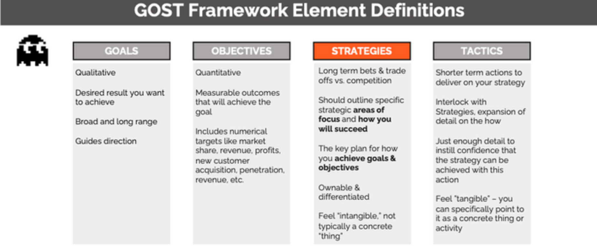

# Strategy

The strategy of a threat hunting program is a thoughtfully constructed plan or
approach that outlines how the program will achieve the mission. It’s worth
nothing that strategies play a role in how goals and objectives are accomplished
as well but for the purposes of this section, we will focus on strategy as it
relates to the program’s mission.

A well-crafted strategy provides a clear roadmap sets the tone of the actions
people in the organization should take and identify the priorities to achieve
the desired goals. It is important to note that a strategy is not a mission
statement. When applied properly a strategy will dictate how resources will be
allocated to accomplish the mission. Therefore, threat hunting organizations
should develop a mission statement first before developing a strategy for the
threat hunting program.

It is worth noting that an organization’s strategy is dynamic as it will
continue to change as it adapts to new goals and objectives. Strategies are
critical to the success of a threat hunting program because they are the driving
force behind creating the plans and actions to accomplish goals.

# Goals and Objectives

Every threat hunt program, in fact every hunter, must have a goal in order to
succeed. A goal is the desired result that a program or hunter plans to
accomplish. Goals should be specific, realistic, and attainable and usually have
a deadline. Goals can either be short term or long term and can be any of these
types:

**Long-term goals:**

Big picture goals that often stretch over a significant amount of time and
require accomplishing short term goals to complete.

Example: Make the threat hunting program a leader within the security
organization

**Short-term goals:**

How long-term goals are broken down into manageable pieces. Short-term goals
tend to be easily measured and associated with a specific time period.

Example: Increase awareness of the value threat hunting will bring to the
organization

**Performance-based goals:**

Performance-based goals are associated with specific tasks or objectives that
are easy to measure or evaluate. Performance-based goals are often associated
with a specific time period.

Example: Migrate 100 threat hunts to automated detections by the end of Q1.

**Quantitative goals:**

Quantitative goals are directly associated on hard data such as percentages,
numbers, or statistics.

Example: Reduce SOC false positive triage efforts by 25% by redesigning existing
automated detections through threat hunting process.

**Qualitative goals:**

Qualitative goals are ones that are felt more than measured. The achievement of
qualitative goals are not based on hard data but on the impact on the
satisfaction and worth of the person or program.

Example: Improve relations between SOC and threat hunting team.

**Outcome-oriented goals:**

Outcome goals are centered on the end-results specifically stating what the goal
is designed achieve. Outcome goals do not detail how the end-result will be
achieved but rather states clearly what is to be achieved.

Example: Establish and implement a threat hunting process

**Process-oriented goals:**

Process goals are detailed plans of action and track the progress of steps taken
to advance. Process goals are about the way the threat hunt team does things,
not about the results.

# GOST Framework

The Harvard Business Review’s Robert Kaplan 95% of employees are unaware of or
do not understand their company’s strategy[^1] indicating that there is clear
disconnect between a company’s overarching strategic management plan and the
people who are meant to execute it. The GOST framework stands for Goals
Objectives Strategy and Tactics and provides a way to bring visibility and
clarity to what an organization is trying to do and how they are going to do it.

[^1]: https://pubmed.ncbi.nlm.nih.gov/16250626/

On a smaller scale, threat hunters should be aware of the overall strategy of
the threat hunting organization. When threat hunt teams do not understand what
the team is trying to accomplish, why it is important, and what is expected of
them it can result in confusion, decreased morale, and a lack confidence in
leadership.

Breaking down the GOST framework, you can see that there is a clear distinction
between the components of the framework in terms of what the team is trying to
accomplish and how they are meant to accomplish it.

Goals are what you want to achieve broadly, and they are qualitative. Objectives
are quantitative measurements or numeric targets that describe the specific
outcomes that define your goal such as marketing penetration, profit, and
revenue. Strategy is the high-level plan you will follow to achieve your goals
and tactics are specific actions you will take to achieve your goals.

https://ebrary.net/116529/management/gost_framework

Strategy Kiln GOST Framework[^2]

[^2]: https://www.strategykiln.com/post/gost-busters-goals-objectives-strategies-and-tactics-explained-with-an-amazon-example

## Example GOST for Threat Hunting

Goal:

-   To be the driving force in high quality automated detections for indicators
    of attack (IoA) and tactics, techniques, and procedures (TTPs) of an
    attacker.

Objectives:

-   Increase endpoint visibility by deploying a EDR solution to 75% of the
    entire workstation and server fleet over the next 12 months.

-   Identify the top 5 threats to the organization and map those threats to data
    sources and centralize 100% of those data sources within 6 months.

-   Average migration of 1 threat hunt to an automated detection per week over
    the next year.

Strategy:

-   Focus efforts on identifying and developing threat hunts that are relevant
    to the organization and good candidates for automation.

Tactics:

-   Establish and nurture a relationship with the SOC to build a threat hunt to
    automated detection pipeline.

-   Develop and implement a process to migrate a threat hunt to an automated
    detection to be managed by the SOC

-   Develop and implement a threat hunting process that has includes quality
    control and documentation standards

## Communication Strategy

No one is going to care how good your team is if you can’t communicate how good
your team is.

One of the more underrated aspects of designing and operating a threat hunting
organization is developing a strategy to communicate with leadership how the
investment into threat hunting is generating a positive impact on the
organization. If the only message the threat hunt team delivers to key
stakeholders and leadership is whether threat hunting identified malicious
activity, it will be extremely difficult to realize the full value threat
hunting is bringing to the organization.

Detecting malicious activity is clearly part of threat hunting and when
malicious activity is discovered through threat hunting, it should immediately
be presented to leadership however, threat hunting can also improve the general
security posture of the organization by reducing attack surface, improving
detection capabilities, improve security data quality, and identify enablers of
an attack.

The first step is to identify and generate valuable metrics and KPIs (see the
Metrics section of the OTHF for more details on metric generation) which
underpin the communication strategy of the threat hunting program. Without good
data to back up your communications strategy there is very little chance for
success. At the same time, if all you have is good data the likelihood of that
data making an impact on the perception of the threat hunting program to
leadership will be reduced.

A communication strategy can help the threat hunt program by tying together the
relevant metrics into unified story which stakeholders can not only easily
understand the data but also understand why they should care.

A threat hunting communication strategy should include:

-   Goal

-   Key Messaging

-   Target stakeholders

-   Metric alignment

**Goal** – Desired results for the program delivering the communication. The
goal should align with short-, medium-, or long-term goals of the program.

**Key Messaging** – Whenever you communicate, you want each receiver to
understand the basic points and takeaways. The basic points and takeaways are
the key messages, and each receiver should be able to sum up the point of what
is being said within a sentence or two.

**Target Stakeholders** – A stakeholder is any individual or that has an
interest in an organization and the outcomes of its actions. With regards to
threat hunting, there will likely be a core set of stakeholders such as the CSO
and CISO however depending on the content of the communications, there may be
additional stakeholders that will need to be receive the communications as well.
Identifying and including the appropriate stake holders for the information is a
vital component to effective communication.

**Metric alignment** – Metrics should not be the main component of the
communications, but they should underpin the story of the communications.
Mapping the correct metrics, to key messaging, to the appropriate stakeholders
enables the communicator to select the 1 or 2 metrics that quantify the value of
a specific data point for the organization, specific business unit, or team.

| Goal                                                                                                                                                                                                                                                                                                                                 | Key Messaging                                                                                                                                         | Stakeholders           | Aligned Metrics                                                                                                |
|--------------------------------------------------------------------------------------------------------------------------------------------------------------------------------------------------------------------------------------------------------------------------------------------------------------------------------------|-------------------------------------------------------------------------------------------------------------------------------------------------------|------------------------|----------------------------------------------------------------------------------------------------------------|
| Highlight how the threat hunt team is becoming more efficient by identify threat hunts which can be automated and how automated detections from the threat hunt team provide the SOC with high quality alerts. Further buy into threat hunting team creating automated detections can be used for increase funding for data sources. | Threat hunting helps the SOC by creating actionable detections  Threat hunt team is continuing to scale by automating threat hunts through detections | CSO, CISO, SOC Manager | Number of threat hunts migrated to automated detections past 30 days  False positive reductions past 30 days   |
| Goal 2                                                                                                                                                                                                                                                                                                                               | Key Messaging 2                                                                                                                                       | Stakeholders 2         | Metrics 2                                                                                                      |
| Goal 3                                                                                                                                                                                                                                                                                                                               | Key Messaging 3                                                                                                                                       | Stakeholders 3         | Metrics 3                                                                                                      |

With the communication strategy built, communications become easier to do and
more importantly more effective. It is worth the time, to build out a Goal, Key
Messaging, Stakeholders, and Metrics mapping for each of the metrics that you
are tracking within your threat hunting program.

# Continuous Improvement

Continuous improvement is any strategy, framework, or process that organizations
implement to provide sustained and structured efforts towards improving business
functions. Threat hunt teams that implement a continuous improvement strategy
and actively seek improvement opportunities will have a much better chance at
generating value over time for both the organization and for hunters. Value
comes in the form of improved analysis capabilities, data quality, metrics, and
reduced risk due to threats.

Kaizen, a continuous and never-ending quest for improvements is essential for
Threat Hunting program. Threat Hunt program cannot exist in vacuum. First and
foremost, hunting is an essential component of security program continuous
improvement. This section, however, aims to focus on improving the efficiency,
effectiveness, and quality of each component of hunting process.

## Continual Improvement Model

The lessons learned activity must be carried out after each hunt. Lessons
learned feedback and documentation should ensure that the team retrospectively
reviews and analyzes all process areas of threat hunting. The analysis should
provide the details: if objectives of threat hunt were met such as quality of
threat intelligence data, workflow applicability, organizational environment,
the data reliability gaps, if the team was adequately staffed with skilled
resources, and if the time allocated was adequate.

The purpose of continual improvement is to ensure the service, offering, or
product remains aligned to the organization’s goals. As it applies to threat
hunting, this requires visibility into the operation in entirety, as the overall
improvement of the operations is the result of improvement realized at all
levels. This includes people, processes, and technology all are expected to
perform at the requisite level to facilitate value.[^3]

[^3]: https://www.knowledgehut.com/tutorials/itil4-tutorial/itil-continual-improvement-model

One of the more important aspects of a successful threat hunting operation is
the ability to effectively demonstrate the value threat hunting brings to the
organization. The Continual Improvement Model (CIM) is a highly effective way
for threat hunt teams to implement a culture of improvement and establish a
pipeline of data points that can be expressed to senior management to show how
threat hunting is improving and bringing value to the organization.

ITIL Continuous Improvement Model

QPR International describes implementation recommendations for the ITIL
Continuous Improvement Model through the following steps[^4]:

[^4]: https://www.qrpinternational.be/blog/it-governance-and-service-management/itil-4-continual-improvement/\#:\~:text=The%20ITIL%204%20continual%20improvement,Service%20Value%20System%20(SVS).

What is the vision?

-   The improvement should always support the organization’s goals and
    objectives.

-   It should also link individual actions to the future vision, in order that
    it really can be seen as an improvement.

Where are we now?

-   For an improvement to really impact, it should have a clear starting point.
    The step ‘where are we now’ helps you to assess your current situation, from
    a technical, human resource and user’s perception perspective.

Where do we want to be?

-   This step helps you visualize your improvement initiative.

-   Here you set your Key Performance Indicators (KPI’s) and the objectives of
    the improvement initiative.

How do we get there?

-   The fourth step helps you plan. The continual improvement model advises to
    work iteratively, however with some initiatives this might not be needed,
    and another approach will suffice.

Take action!

-   Execute the plan that you created in the fourth step. A measurement process
    is key in this step as it will help you stay on track. To execute the plan,
    you can use any type of approach that you think fits best (waterfall, big
    bang or small iterations).

Did we get there?

-   Check and confirm the progress and the value of the improvement initiative.

-   If the desired result has not been achieved, additional actions need to be
    taken (often in a new iteration).

How do we keep the momentum going?

-   If the initiative is a success, use it to build support and momentum for the
    next improvement initiatives.

-   To do so, share the success both internally and externally. If the
    initiative failed to achieve success, make sure to use it for your ‘lessons
    learned’. This way the initiative did create value, even though it was not a
    success.

# Maturity Models

The Open Group information security management maturity model (O-ISM3) describes
a maturity as the measurement of an organization’s ability implement continuous
improvement practices within a particular discipline. With a focus on continuous
improvement, maturity models are well suited for assessing threat hunting
operations.

Why maturity models are important for threat hunt teams:

-   Benchmarking – Determine where the threat hunt team is in terms of current
    state and compare against goals and objectives for performance improvement.

-   Performance Improvement – With a model a threat hunt team can directly track
    their operations against the best practices defined by the model. Maturity
    models can help organizations identify gaps which a plan that addresses
    specific issues.

-   Unified improvement language – Implementing a maturity model ensures that
    the entire threat hunting organization is aligned on future goals and using
    the same language to discuss capabilities that would enable the organization
    to increase their maturity with respect to the model.

The SQRRL “A Framework for Cyber Threat Hunting”[^5] white paper is one of the
most important papers released to the world of threat hunting and serves as a
foundational part of the OTHF. Within SQRRL’s works, they introduce the concept
of threat hunting specific maturity model and a set of criteria in which a
threat hunting program can be evaluated against.

[^5]: https://www.threathunting.net/files/framework-for-threat-hunting-whitepaper.pdf

Through the introduction of a maturity model, SQRRL created a way for threat
hunt teams to build short-, medium-, and long-term goals through some high-level
characteristics associated with the varying levels of maturity. Depending on the
organization, they may want to have more specific requirements and assessment
criteria laid out within the model and so the OTHF has created a maturity model
that organizations can use to assess their maturity against.

## SQRRL Maturity Model

SQRRL Hunting Maturity Model

Full details of the SQRRL Maturity Model can be found in the whitepaper:
<https://www.threathunting.net/files/framework-for-threat-hunting-whitepaper.pdf>

## OTHF Maturity Model

| LEVEL 0  Ad Hoc                                                                                                                           | LEVEL 1 Foundational                                                                                                                                                                                                                                                                                                                | LEVEL 2 Functional                                                                                                                                                                                                                                  | LEVEL 3  Effective                                                                                                                                                                                                                                                                                                                                                                                                                                                                                            | LEVEL 4  Optimal                                                                                                                                                                                                                                                                                                                                                                                                                                                                                                                            |
|-------------------------------------------------------------------------------------------------------------------------------------------|-------------------------------------------------------------------------------------------------------------------------------------------------------------------------------------------------------------------------------------------------------------------------------------------------------------------------------------|-----------------------------------------------------------------------------------------------------------------------------------------------------------------------------------------------------------------------------------------------------|---------------------------------------------------------------------------------------------------------------------------------------------------------------------------------------------------------------------------------------------------------------------------------------------------------------------------------------------------------------------------------------------------------------------------------------------------------------------------------------------------------------|---------------------------------------------------------------------------------------------------------------------------------------------------------------------------------------------------------------------------------------------------------------------------------------------------------------------------------------------------------------------------------------------------------------------------------------------------------------------------------------------------------------------------------------------|
| - A process is not defined and has no standardized process - Relies primarily on automated alerting. Little or no routine data collection | - A process area is loosely defined - Capabilities are based mainly on tribal knowledge and are not aligned to industry standards  - A process area lacks standardized process documentation Leverage threat intelligence to retrospectively search data sets for IOCs. Ad-hoc data searches for adversary tools (tribal knowledge) | - A process area is formally defined with supporting capabilities -A standardized and documented process supports Capabilities - Leveraged MITRE ATT&CK to drive change towards platforms that support real-time and metadata collections at scale. | - A process area is formally defined with supporting capabilities  -Capabilities are supported by a well-defined, standardized, and documented process.  - Formal procedures are defined for common tasks  - Incorporation of a detection framework and threat hunting development loop. Threat hunting is a driver for automated detection. Threat hunts are executed as part of a detection framework where successful hypothesis-based hunts are executed and then transitioned into automated detections. | - A process area is formally defined with supporting capabilities  - Capabilities are supported by a well-defined, standardized, and documented process.  - Formal procedures are defined for common tasks  - Centralized data and platform leveraging standardized data sources and structure supporting an intelligence-driven threat hunting framework. Strategic threat assessments provide tactical intelligence that drives the threat hunting development lifecycle.  - Processes are measured, automated, and continuously improved |

### Assessment Criteria

This section outlines the assessment criteria for each process area in scope

Subcategories Criteria

|                  | **LEVEL 0**                                                                                                                                                                                                                         | **LEVEL 1**                                                                                                                                                                                                                                                                                           | **LEVEL 2**                                                                                                                                                                                                                                                                                                                                                                                                                                                                                  | **LEVEL 3**                                                                                                                                                                                                                                                                                                                                                                                                                                                                                                                                                                                                                                                 | **LEVEL4**                                                                                                                                                                                                                                                                                                                                                                                                                                                                                                                                                                                                                                              |
|------------------|-------------------------------------------------------------------------------------------------------------------------------------------------------------------------------------------------------------------------------------|-------------------------------------------------------------------------------------------------------------------------------------------------------------------------------------------------------------------------------------------------------------------------------------------------------|----------------------------------------------------------------------------------------------------------------------------------------------------------------------------------------------------------------------------------------------------------------------------------------------------------------------------------------------------------------------------------------------------------------------------------------------------------------------------------------------|-------------------------------------------------------------------------------------------------------------------------------------------------------------------------------------------------------------------------------------------------------------------------------------------------------------------------------------------------------------------------------------------------------------------------------------------------------------------------------------------------------------------------------------------------------------------------------------------------------------------------------------------------------------|---------------------------------------------------------------------------------------------------------------------------------------------------------------------------------------------------------------------------------------------------------------------------------------------------------------------------------------------------------------------------------------------------------------------------------------------------------------------------------------------------------------------------------------------------------------------------------------------------------------------------------------------------------|
| **PEOPLE**       | - A threat hunting role does not exist or is informal - A skills catalog does not exist. No hunter training program is available                                                                                                    | A threat hunting team exists but role description and expectations are informal documented and communicated.   - A rudimentary skills catalog exists, with no defined criteria, requirements, or a plan. No hunter training program is available.                                                     | A threat hunting team exists with dedicated roles and expectations are formally documented and communicated.   - A functional skills catalog exists, with defined criteria, requirements, or a plan. However, the skillset is assessed by the TH program leadership on an ad hoc basis.  There is no formalized plan for addressing gaps. No hunter training program a                                                                                                                       | - A effective skills catalog exists, with defined criteria, requirements, or a plan. However, skillset is assessed by the TH program leadership on a ad hoc basis. Criteria and requirements are defined, and a formalized mentoring program is in place for bridging the skills gaps   - A formalized training program is established for all levels of hunters.   - A formal recruiting plan is in place.                                                                                                                                                                                                                                                 | - A robust skills catalogue exists, with a defined criteria, requirements, or a plan. However skillset is assessed by the TH program leadership as well as through self-assessment on a regular basis. Criteria and requirements are well defined, and a formalized mentoring program is in place for bridging the skills gaps.   -A cross training program is in place for inter-departmental training   - A formal recruiting plan is in place.                                                                                                                                                                                                       |
| **PROCESS**      | - A hunting framework does not exist or is in its infancy   - Threat hunting does not exist                                                                                                                                         | - A hunting framework is informally documented - Threat hunting is mainly a reactive service when incident response activity arises - The process area covers less than 50% of the organization                                                                                                       | - A hunting framework is formalized and documented   - Threat hunting is proactively continued regardless of incident response activities   - No automated detection framework in place.   - The process area covers 50% to 75% of the organization                                                                                                                                                                                                                                          | - A formalized hunting framework is regularly executed. Outcomes are consistently discussed with impacted stakeholders.   - A Threat Hunting mission statement has not been defined.   - Hunts are constantly documented and reviewed with the ability to be turned into automated detection   - The process area covers 75% to 90% of the organization                                                                                                                                                                                                                                                                                                     | - The threat hunting frameworks is regularly reviewed and validated for efficiency. - A clear Threat Hunting mission statement has been defined and understood by the team.   - Stakeholder feedback validates that the hunt outcome meets or exceeds expectations.   - Newly developed are shared with the threat hunting community.   - Hunts are constantly documented and reviewed and turned into automated detection   - The process area covers 90% to 100% of the organization                                                                                                                                                                  |
| **DATA SOURCE**  | - Visibility on data sources is unknown   - Quality of data sources is unknown - No tools or processes to passively collect data                                                                                                    | - Visibility on data sources is partially understood   - Data sources are informally documented - Tools are present to passively collect data   - The data sources covers less than 50% of the organization                                                                                           | - Visibility and quality of data sources are informally measured   - Available hunting data sources are formally documented   - Collection tools are part of the threat hunt program too actively collect data   - The data sources covers 50% to 75% of the organization                                                                                                                                                                                                                    | - Visibility and quality on data sources is formally measured and in place   - Data collection is executed consistently   - Hunting techniques include data science   - The data sources covers 75% to 90% of the organization including critical assets                                                                                                                                                                                                                                                                                                                                                                                                    | - A standard exists for enterprise wide logging and documentation   - Standardization of hunting data sources is fully automated   - Hunt operations include data science techniques   - The data sources cover 90% to 100% of the organization across network and endpoint.                                                                                                                                                                                                                                                                                                                                                                            |
| **THREAT INTEL** | - Threat intelligence is not a function within the organization or is still in its infancy   - Threat intelligence is never or rarely collected   - No CTI technology   - No technology integration or Data is raw and unformatted. | - Threat intelligence sharing is reported on an ad hoc basis. Expectations are informal documented and communicated.   - Threat intelligence scope is global and org specific   - Threat Intelligence platform exists with updated feeds   - Technology Integration: SIEM, Firewall/Proxy, or IDS/IPS | - Threat intelligence sharing is a separate function within the organization and expectations are formally documented and communicated.   -Threat intelligence scope is global, org specific, and industry specific.   -Teams take external and internal data input to shift from a reactive to a proactive posture.   - Threat intelligence platform exists alongside an IOC tool   - Technology Integration: TIP, SIEM, Firewall/Proxy, or IDS/IPS is being integrated within threat intel | - Threat intelligence sharing is a separate function within the organization and expectations are formally documented and communicated.   - Region-specific, global, industry-specific, org specific   - Contributors and members of organizations such as Information Sharing and Analysis Centers (ISACs) and Information Sharing and Analysis Organizations (ISAOs)   - Automation of some threat intelligence analysis tasks   - Technology Integration: TIP, SIEM, defensive tools, incident response system, and all security data is being integrated within threat intel   - Supports IR engagements based on knowledge of the adversaries involved | - Threat Intelligence is a key function that allows the business to make operationally and strategically aligned decisions. - Create tactical an strategic TI - Team has the capability to build custom applications and processes   - Majority of TI is automated   - Advanced analytics and orchestration capabilities - Region-specific, global, industry-specific, org specific   - Contributors and members of organizations such as Information Sharing and Analysis Centers (ISACs) and Information Sharing and Analysis Organizations (ISAOs)   - A sophisticated threat intelligence platform exists that allows the team to build out a SOAPA |
| **METRICS**      | - Few or no metrics are identified, tracked, or reported                                                                                                                                                                            | - Key metrics are reported on an ad hoc basis   - Key metrics are identified and measurement elements are accurate                                                                                                                                                                                    | - Performance targets such as operational metrics and key performance indicators is accurate and communicated to management                                                                                                                                                                                                                                                                                                                                                                  | - Metrics are formally tracked and reviewed. Output is communicated and reported to management on a regular schedule.   - Improvements are discussed but not a critical priority                                                                                                                                                                                                                                                                                                                                                                                                                                                                            | - Improvements are prioritized for areas where performance is not meeting target goals.   - Operational metrics are updated in real-time via automation   - Hunt outcomes included in risk assessments                                                                                                                                                                                                                                                                                                                                                                                                                                                  |
