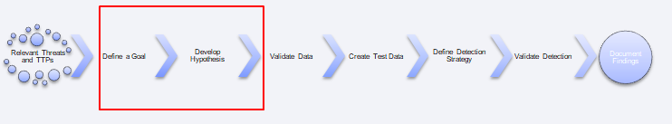
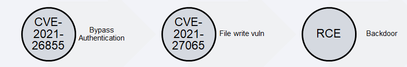
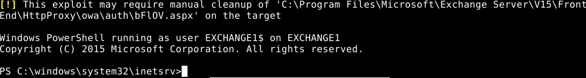
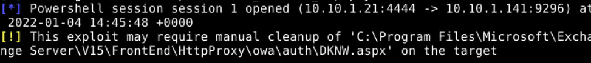
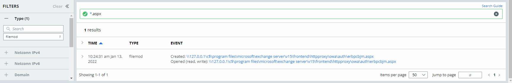

**Practice Scenario 1** – Develop a Goal and a Hypothesis for a threat hunt
designed to detect successful exploitation of the ProxyLogon vulnerability.

**Information gathering:**

ProxyLogon (CVE-2021-26855) – vulnerability in Microsoft Exchange Server that
enables a remote attacker to bypass authentication. Combined with
CVE-2021-27065, a remote attacker can achieve arbitrary remote code execution on
a vulnerable Exchange Server.

References:  
<https://devco.re/blog/2021/08/06/a-new-attack-surface-on-MS-exchange-part-1-ProxyLogon/>

https://proxylogon.com/\#:\~:text=What%20is%20ProxyLogon%3F,and%20impersonating%20as%20the%20admin.

Based on our understanding of the vulnerability and by testing with available
exploits such as the Metasploit ProxyLogon RCE module, we know that the exploit
will write an ASPX file to the OWA directory on the Exchange Server with an
ExternalURL parameter configured to enable the remote execution of commands once
the .ASPX file is loaded

File Modified Name: C:\\program files\\microsoft\\exchange\\
server\\v15\\frontend\\httpproxy\\owa\\auth\\\*

Process Name:w3wp.exe

**Example Goal and Hypothesis:**

Goal: Detect successful exploitation of CVE-2021-26855 & CVE-2021-27065 via the
Metasploit ProxyLogon RCE module through the analysis of file activity on a
vulnerable Exchange Server.

Hypothesis:  
Given a Microsoft Exchange CAS is vulnerable to CVE-2021-26855 & CVE-2021-27065,
when a remote adversary leverages the ProxyLogon RCE module within Metasploit to
establish interactive access to the system, then a malicious ASPX file will be
written to C:\\Program Files\\Microsoft\\V15\\Front End\\HttpProxy\\owa\\auth\\
or c:\\inetpub\\wwwroot.

**Analysis:**

Are there any potential blind spots or issues with this Goal and Hypothesis? How
would you improve upon this Goal and Hypothesis? Submit your Goals and
Hypothesis to the Github repo as a PR for review and inclusion in the workbook!
