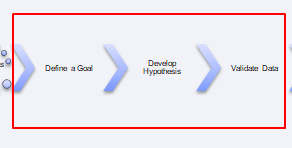
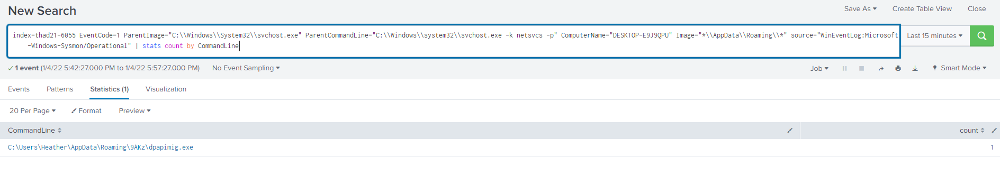
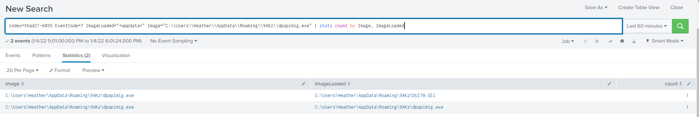

Practice 2: Process and Apply Threat Intelligence Reports to Threat Hunts

Process the following malware analysis for Dridex and develop a threat hunt goal
and hypothesis for a threat hunting for Dridex persistence.

Bonus: If you have a lab environment, use this exercise to validate you have the
right data for your threat hunt!

[Dridex Loader
Analysis](Lexfo's%20security%20blog%20-%20Dridex%20Loader%20Analysis.pdf) from
<https://blog.lexfo.fr/dridex-malware.html>

**Goal**: Detect Dridex Scheduled Task Persistence through analysis of process
execution metadata.  

**Hypothesis**: Given a Windows machine is infected with the Dridex malware,
when the malware is not running a scheduled task will execute a legitimate
System32 executable within %APPDATA% which will sideload a malicious DLL upon
execution.

**Data Validation:**

**Your Turn:**

Are there any issues with this goal and hypothesis? How would you improve it?

Based on the malware analysis report, what are some other ways to hunt for the
Dridex sample detailed in the report? Submit your thoughts, goals and hypothesis
to the GitHub repo as a PR to be included in the practice!
