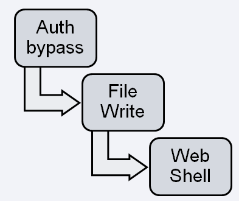
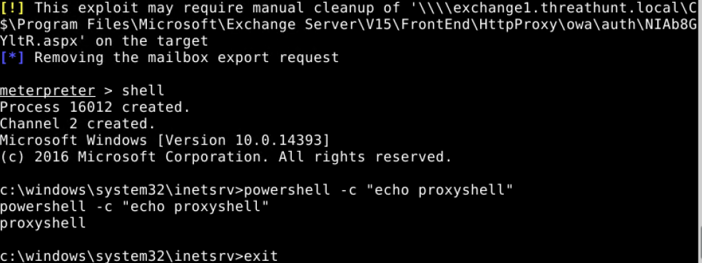
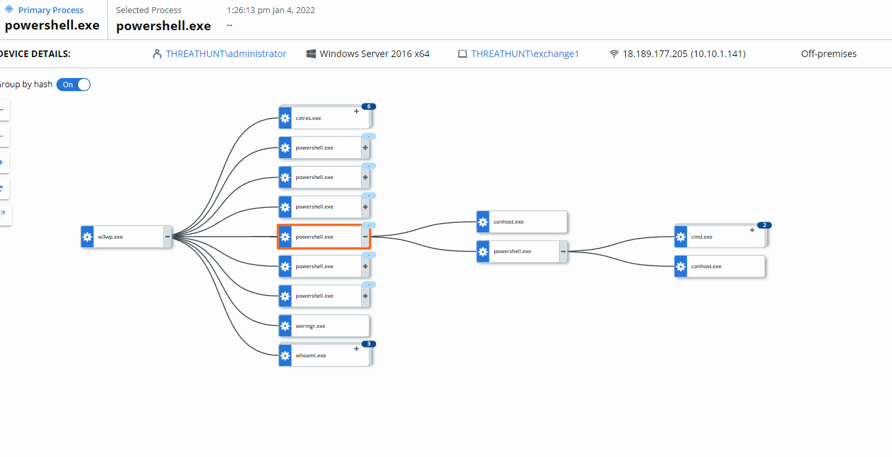
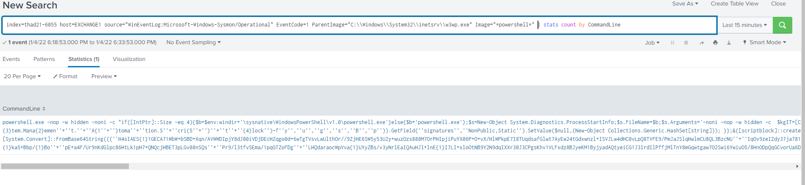

**Create Test Data for Process Activity indicative of ProxyShell exploitation**

**Information Gathering**:

The vulnerabilities lie in the Microsoft Client Access Service (CAS) that
typically runs on port 443 in IIS (Microsoft’s web server). CAS is commonly
exposed to the public internet to enable users to access their email via mobile
devices and web browsers. Remote attackers can exploit 3 separate CAS
vulnerabilities within Microsoft Exchange to bypass authentication and obtain
privileged remote code execution capabilities.

Vulnerability Chain for ProxyShell

[**CVE-2021-34473**](https://msrc.microsoft.com/update-guide/vulnerability/CVE-2021-34473)**

**Pre-auth path confusion vulnerability to bypass access control

[**CVE-2021-34523**](https://msrc.microsoft.com/update-guide/vulnerability/CVE-2021-34523)**

**Privilege elevation vulnerability in the Exchange PowerShell backend  
[**CVE-2021-31207**](https://msrc.microsoft.com/update-guide/en-US/vulnerability/CVE-2021-31207)

Post-auth remote code execution via arbitrary file write

Based on our understanding of the available ProxyShell exploits such as
Metasploit ProxyShell RCE module, we know that the exploit will load a reverse
shell hosted in IIS therefore the attacker will be able to execute
post-exploitation commands as a child process to the IIS worker process.

**Create Test Data:**

****

****

****

**Your Turn: What other mechanisms are there to create test data for a hunt
associated with Proxy Shell exploitation? How would you create that data? Submit
your answers to the GitHub repo as a PR!**
